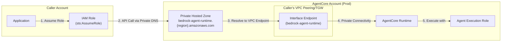
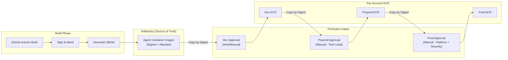

# Amazon Bedrock AgentCore Platform - Target Architecture

## Executive Summary

This document defines a production-ready Amazon Bedrock AgentCore platform spanning three AWS accounts (dev, preprod, prod). The architecture prioritizes auditability, least privilege, and deterministic behavior suitable for banking regulatory requirements.

---

## Architecture Principles

| Principle | Implementation |
|-----------|----------------|
| **Environment Parity** | All accounts are architecturally identical; only scale_profile varies |
| **Auditability** | Every action traceable, every artifact versioned, every promotion gated |
| **Least Privilege** | Capability bundles, permission boundaries, explicit cross-account trust |
| **Deterministic Behavior** | Pinned digests, explicit promotions, no implicit automation |
| **Blast Radius Isolation** | Per-account state, per-agent roles, per-env endpoints |

---

## High-Level Architecture Diagram

```mermaid
flowchart TB
    subgraph External["External Systems"]
        Artifactory["Artifactory<br/>(Artifact Source of Truth)"]
        GitHub["GitHub Actions<br/>(CI/CD + Approvals)"]
        Splunk["Splunk<br/>(Log Aggregation)"]
    end

    subgraph DevAccount["AWS Account: Dev"]
        subgraph DevVPC["VPC (Dev)"]
            DevNAT["Single NAT Gateway"]
            DevRuntime["AgentCore Runtime<br/>(VPC-Attached)"]
            DevEndpoints["AgentCore Endpoints<br/>(Pinned Digests)"]
            DevVPCE["VPC Endpoints<br/>(Interface + Gateway)"]
        end
        DevECR["ECR Repository"]
        DevCW["CloudWatch<br/>Logs/Metrics/Alarms"]
        DevIAM["IAM Execution Roles<br/>(Per-Agent)"]
    end

    subgraph PreprodAccount["AWS Account: Preprod"]
        subgraph PreprodVPC["VPC (Preprod)"]
            PreprodNAT["NAT per AZ (3x)"]
            PreprodRuntime["AgentCore Runtime<br/>(VPC-Attached)"]
            PreprodEndpoints["AgentCore Endpoints<br/>(Pinned Digests)"]
            PreprodVPCE["VPC Endpoints<br/>(Interface + Gateway)"]
        end
        PreprodECR["ECR Repository"]
        PreprodCW["CloudWatch<br/>Logs/Metrics/Alarms"]
        PreprodIAM["IAM Execution Roles<br/>(Per-Agent)"]
    end

    subgraph ProdAccount["AWS Account: Prod"]
        subgraph ProdVPC["VPC (Prod)"]
            ProdNAT["NAT per AZ (3x)"]
            ProdRuntime["AgentCore Runtime<br/>(VPC-Attached)"]
            ProdEndpoints["AgentCore Endpoints<br/>(Pinned Digests)"]
            ProdVPCE["VPC Endpoints<br/>(Interface + Gateway)"]
        end
        ProdECR["ECR Repository"]
        ProdCW["CloudWatch<br/>Logs/Metrics/Alarms"]
        ProdIAM["IAM Execution Roles<br/>(Per-Agent)"]
    end

    subgraph CallerAccounts["Cross-Account Callers"]
        CallerA["Application Account A"]
        CallerB["Application Account B"]
    end

    %% Promotion Flow
    Artifactory -->|"Copy by Digest<br/>(Approval Gate)"| DevECR
    DevECR -->|"Copy by Digest<br/>(Approval Gate)"| PreprodECR
    PreprodECR -->|"Copy by Digest<br/>(Approval Gate)"| ProdECR
    GitHub -->|"Orchestrate"| Artifactory

    %% Cross-Account Invocation
    CallerA -->|"Interface Endpoint<br/>+ Private DNS"| ProdVPCE
    CallerB -->|"Interface Endpoint<br/>+ Private DNS"| ProdVPCE
    ProdVPCE --> ProdRuntime

    %% Observability
    DevCW -->|"Firehose"| Splunk
    PreprodCW -->|"Firehose"| Splunk
    ProdCW -->|"Firehose"| Splunk

    %% Runtime to ECR
    DevRuntime --> DevECR
    PreprodRuntime --> PreprodECR
    ProdRuntime --> ProdECR

    classDef account fill:#e1f5fe,stroke:#01579b
    classDef vpc fill:#f3e5f5,stroke:#4a148c
    classDef external fill:#fff3e0,stroke:#e65100
    classDef caller fill:#e8f5e9,stroke:#1b5e20

    class DevAccount,PreprodAccount,ProdAccount account
    class DevVPC,PreprodVPC,ProdVPC vpc
    class Artifactory,GitHub,Splunk external
    class CallerA,CallerB caller
```

---

## Cross-Account Invocation Pattern

---

## Artifact Promotion Flow

---

## Why This Architecture

### Why VPC-Attached Runtime
- **Chosen**: VPC-attached AgentCore Runtime with interface endpoints
- **Why**: Enables private connectivity, meets banking network security requirements, allows cross-account invocation without internet traversal
- **Why not public endpoints**: Violates bank security policy; all traffic must remain on private networks

### Why Copy by Digest (Not Tag)
- **Chosen**: Immutable digest-based promotion between ECR repositories
- **Why**: Guarantees byte-for-byte identical artifacts across environments; prevents tag mutation attacks; enables deterministic rollback
- **Why not tag-based promotion**: Tags are mutable; same tag could point to different content in different accounts

### Why NAT per AZ in Prod/Preprod
- **Chosen**: 3 NAT Gateways (one per AZ) in prod/preprod; single NAT in dev
- **Why**: Eliminates cross-AZ NAT as single point of failure; required for production HA SLAs
- **Why not single NAT everywhere**: Unacceptable blast radius for production workloads; AZ failure would impact all outbound traffic

### Why Per-Account State
- **Chosen**: Separate Terraform state per environment/account
- **Why**: Blast radius isolation; independent audit trails; enables parallel applies; prevents cross-env state corruption
- **Why not workspaces**: Workspaces share state backend; increases blast radius; harder to audit independently

### Why Execution Role per Agent
- **Chosen**: One IAM execution role per agent per environment
- **Why**: Least privilege; per-agent audit trail; capability isolation; enables per-agent permission boundaries
- **Why not shared role**: Violates least privilege; shared blast radius; impossible to audit per-agent actions

