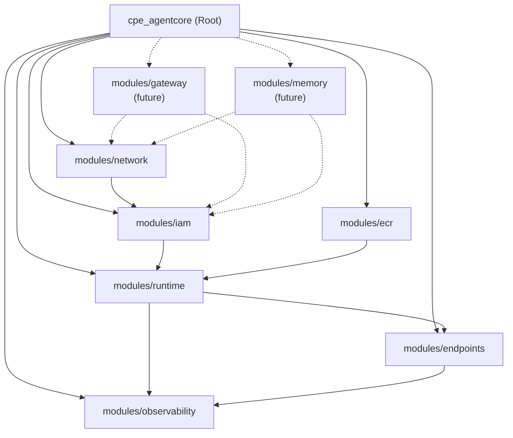

# Terraform Module Design

## Module Structure

```
cpe_agentcore/
├── README.md
├── main.tf                    # Root orchestration
├── variables.tf               # Root input contract
├── outputs.tf                 # Root output contract
├── providers.tf               # Provider configuration
├── versions.tf                # Version constraints
├── locals.tf                  # Normalization and derived values
├── data.tf                    # Data sources (caller identity, region, etc.)
│
├── modules/                   # INTERNAL submodules (not independently consumable)
│   ├── ecr/
│   │   ├── main.tf
│   │   ├── variables.tf
│   │   ├── outputs.tf
│   │   └── README.md
│   │
│   ├── network/
│   │   ├── main.tf
│   │   ├── variables.tf
│   │   ├── outputs.tf
│   │   ├── vpc_endpoints.tf
│   │   ├── private_dns.tf
│   │   └── README.md
│   │
│   ├── iam/
│   │   ├── main.tf
│   │   ├── variables.tf
│   │   ├── outputs.tf
│   │   ├── execution_roles.tf
│   │   ├── capability_bundles.tf
│   │   ├── permission_boundaries.tf
│   │   └── README.md
│   │
│   ├── runtime/
│   │   ├── main.tf
│   │   ├── variables.tf
│   │   ├── outputs.tf
│   │   └── README.md
│   │
│   ├── endpoints/
│   │   ├── main.tf
│   │   ├── variables.tf
│   │   ├── outputs.tf
│   │   └── README.md
│   │
│   ├── observability/
│   │   ├── main.tf
│   │   ├── variables.tf
│   │   ├── outputs.tf
│   │   ├── cloudwatch.tf
│   │   ├── alarms.tf
│   │   ├── splunk_forwarder.tf
│   │   └── README.md
│   │
│   ├── gateway/               # Future - feature-flagged
│   │   ├── main.tf
│   │   ├── variables.tf
│   │   ├── outputs.tf
│   │   └── README.md
│   │
│   └── memory/                # Future - feature-flagged
│       ├── main.tf
│       ├── variables.tf
│       ├── outputs.tf
│       └── README.md
│
├── examples/                  # Usage examples (not part of module)
│   ├── dev/
│   │   ├── main.tf
│   │   ├── terraform.tfvars
│   │   └── backend.tf
│   ├── preprod/
│   │   ├── main.tf
│   │   ├── terraform.tfvars
│   │   └── backend.tf
│   └── prod/
│       ├── main.tf
│       ├── terraform.tfvars
│       └── backend.tf
│
└── tests/                     # Terraform tests
    ├── unit/
    └── integration/
```

---

## Dependency Graph



---

## Root Module Implementation

### `versions.tf`

```hcl
terraform {
  required_version = ">= 1.6.0, < 2.0.0"

  required_providers {
    aws = {
      source  = "hashicorp/aws"
      version = ">= 5.40.0, < 6.0.0"
    }
    awscc = {
      source  = "hashicorp/awscc"
      version = ">= 1.0.0, < 2.0.0"
    }
  }
}
```

### `providers.tf`

```hcl
provider "aws" {
  region = var.aws_region

  default_tags {
    tags = local.common_tags
  }

  # Explicit retry configuration for banking reliability requirements
  retry_mode  = "adaptive"
  max_retries = 5
}

provider "awscc" {
  region = var.aws_region
}
```

### `variables.tf`

```hcl
# ==============================================================================
# ENVIRONMENT IDENTIFICATION
# ==============================================================================

variable "environment" {
  description = "Environment identifier (dev, preprod, prod)"
  type        = string

  validation {
    condition     = contains(["dev", "preprod", "prod"], var.environment)
    error_message = "Environment must be one of: dev, preprod, prod."
  }
}

variable "aws_region" {
  description = "AWS region for deployment"
  type        = string

  validation {
    condition     = can(regex("^[a-z]{2}-[a-z]+-[0-9]$", var.aws_region))
    error_message = "AWS region must be a valid region identifier (e.g., us-east-1)."
  }
}

variable "aws_account_id" {
  description = "AWS account ID for deployment"
  type        = string

  validation {
    condition     = can(regex("^[0-9]{12}$", var.aws_account_id))
    error_message = "AWS account ID must be a 12-digit number."
  }
}

# ==============================================================================
# VPC INPUTS (Created externally)
# ==============================================================================

variable "vpc_config" {
  description = "VPC configuration - VPC is created outside this module"
  type = object({
    vpc_id = string
    private_subnet_ids = map(object({
      subnet_id         = string
      availability_zone = string
      cidr_block        = string
    }))
    security_group_ids = object({
      agentcore_runtime   = string
      vpc_endpoints       = string
      nat_gateway_egress  = string
    })
    route_table_ids = map(string) # Key = AZ, value = route table ID
  })

  validation {
    condition     = can(regex("^vpc-[a-f0-9]+$", var.vpc_config.vpc_id))
    error_message = "VPC ID must be a valid VPC identifier."
  }

  validation {
    condition     = length(var.vpc_config.private_subnet_ids) >= 2
    error_message = "At least 2 private subnets across different AZs are required."
  }
}

# ==============================================================================
# SCALE PROFILE (All environment differences expressed here)
# ==============================================================================

variable "scale_profile" {
  description = "Environment-specific scaling configuration"
  type = object({
    # Network scaling
    nat_mode           = string # "per_az" or "single"
    vpc_endpoint_az_count = number # Number of AZs for interface endpoints

    # Runtime scaling
    runtime_concurrency_limit = number
    runtime_memory_mb         = number
    runtime_timeout_seconds   = number

    # Observability scaling
    log_retention_days        = number
    metrics_resolution_seconds = number
    alarm_evaluation_periods  = number

    # Tool execution scaling
    tool_execution_timeout_seconds = number
    tool_max_concurrent_executions = number

    # Feature flags for future capabilities
    enable_gateway = bool
    enable_memory  = bool
  })

  validation {
    condition     = contains(["per_az", "single"], var.scale_profile.nat_mode)
    error_message = "NAT mode must be 'per_az' or 'single'."
  }

  validation {
    condition     = var.scale_profile.vpc_endpoint_az_count >= 1 && var.scale_profile.vpc_endpoint_az_count <= 3
    error_message = "VPC endpoint AZ count must be between 1 and 3."
  }

  validation {
    condition     = var.scale_profile.log_retention_days >= 30
    error_message = "Log retention must be at least 30 days for audit requirements."
  }

  validation {
    condition     = contains([30, 60, 90, 180, 365, 400, 545, 731, 1096, 1827, 2192, 2557, 2922, 3288, 3653], var.scale_profile.log_retention_days)
    error_message = "Log retention must be a valid CloudWatch Logs retention value."
  }

  validation {
    condition     = var.scale_profile.runtime_memory_mb >= 128 && var.scale_profile.runtime_memory_mb <= 10240
    error_message = "Runtime memory must be between 128 and 10240 MB."
  }
}

# ==============================================================================
# AGENT DEFINITIONS
# ==============================================================================

variable "agents" {
  description = "Map of agent configurations to deploy"
  type = map(object({
    name        = string
    description = string
    
    # Runtime configuration
    runtime_version_digest = string # Immutable digest reference
    
    # IAM capability bundles
    capability_bundles = set(string)
    
    # Custom IAM policies (optional)
    custom_policy_arns = optional(set(string), [])
    
    # Resource limits (optional overrides)
    memory_mb_override        = optional(number)
    timeout_seconds_override  = optional(number)
    
    # Tags specific to this agent
    additional_tags = optional(map(string), {})
  }))

  validation {
    condition = alltrue([
      for k, v in var.agents : can(regex("^sha256:[a-f0-9]{64}$", v.runtime_version_digest))
    ])
    error_message = "All agent runtime_version_digest values must be valid SHA256 digests."
  }

  validation {
    condition = alltrue([
      for k, v in var.agents : alltrue([
        for bundle in v.capability_bundles : contains([
          "baseline",
          "s3_readonly",
          "s3_readwrite",
          "dynamodb_readonly",
          "dynamodb_readwrite",
          "secrets_readonly",
          "ssm_parameters_readonly",
          "kms_encrypt_decrypt",
          "sns_publish",
          "sqs_send_receive",
          "lambda_invoke",
          "bedrock_invoke_model"
        ], bundle)
      ])
    ])
    error_message = "Invalid capability bundle specified. Check allowed bundles."
  }
}

# ==============================================================================
# CROSS-ACCOUNT ACCESS
# ==============================================================================

variable "cross_account_access" {
  description = "Configuration for cross-account invocation"
  type = object({
    enabled = bool
    allowed_caller_accounts = set(string)
    allowed_caller_roles    = map(set(string)) # account_id -> role_arns
  })

  default = {
    enabled                 = false
    allowed_caller_accounts = []
    allowed_caller_roles    = {}
  }

  validation {
    condition = alltrue([
      for account in var.cross_account_access.allowed_caller_accounts : can(regex("^[0-9]{12}$", account))
    ])
    error_message = "All caller account IDs must be valid 12-digit AWS account IDs."
  }
}

# ==============================================================================
# OBSERVABILITY CONFIGURATION
# ==============================================================================

variable "observability_config" {
  description = "Observability and monitoring configuration"
  type = object({
    splunk_hec_endpoint       = string
    splunk_hec_token_secret_arn = string
    alarm_sns_topic_arn       = string
    enable_xray_tracing       = bool
    dashboard_enabled         = bool
  })

  validation {
    condition     = can(regex("^https://", var.observability_config.splunk_hec_endpoint))
    error_message = "Splunk HEC endpoint must be an HTTPS URL."
  }

  validation {
    condition     = can(regex("^arn:aws:secretsmanager:", var.observability_config.splunk_hec_token_secret_arn))
    error_message = "Splunk HEC token must be stored in Secrets Manager."
  }
}

# ==============================================================================
# TAGGING
# ==============================================================================

variable "tags" {
  description = "Additional tags to apply to all resources"
  type        = map(string)
  default     = {}

  validation {
    condition = alltrue([
      for k, v in var.tags : can(regex("^[a-zA-Z0-9_.-]+$", k))
    ])
    error_message = "Tag keys must contain only alphanumeric characters, underscores, periods, and hyphens."
  }
}
```

### `locals.tf`

```hcl
locals {
  # ==============================================================================
  # NAMING CONVENTIONS
  # ==============================================================================
  name_prefix = "agentcore-${var.environment}"
  
  # ==============================================================================
  # COMMON TAGS (Applied to all resources)
  # ==============================================================================
  common_tags = merge(
    {
      Environment     = var.environment
      Project         = "agentcore"
      ManagedBy       = "terraform"
      Module          = "cpe_agentcore"
      CostCenter      = "platform-engineering"
      DataClassification = "confidential"
    },
    var.tags
  )

  # ==============================================================================
  # VPC NORMALIZATION
  # ==============================================================================
  availability_zones = distinct([
    for subnet in var.vpc_config.private_subnet_ids : subnet.availability_zone
  ])
  
  az_count = length(local.availability_zones)
  
  # Normalize subnet list for iteration
  subnets_by_az = {
    for az in local.availability_zones : az => [
      for k, v in var.vpc_config.private_subnet_ids : v.subnet_id
      if v.availability_zone == az
    ][0]
  }

  # ==============================================================================
  # NAT GATEWAY LOGIC
  # ==============================================================================
  nat_gateway_count = var.scale_profile.nat_mode == "per_az" ? local.az_count : 1
  
  nat_gateway_azs = var.scale_profile.nat_mode == "per_az" ? local.availability_zones : [local.availability_zones[0]]

  # ==============================================================================
  # VPC ENDPOINTS CONFIGURATION
  # ==============================================================================
  # Core AWS services requiring VPC endpoints
  required_gateway_endpoints = toset(["s3", "dynamodb"])
  
  required_interface_endpoints = toset([
    "bedrock-agent-runtime",
    "bedrock-runtime",
    "bedrock",
    "ecr.api",
    "ecr.dkr",
    "logs",
    "monitoring",
    "secretsmanager",
    "ssm",
    "ssmmessages",
    "kms",
    "sts",
    "xray"
  ])

  # Limit interface endpoints to configured AZ count for cost optimization
  vpc_endpoint_subnet_ids = slice(
    [for az in local.availability_zones : local.subnets_by_az[az]],
    0,
    min(var.scale_profile.vpc_endpoint_az_count, local.az_count)
  )

  # ==============================================================================
  # AGENT NORMALIZATION
  # ==============================================================================
  agents_normalized = {
    for agent_key, agent in var.agents : agent_key => merge(agent, {
      # Apply defaults from scale_profile if not overridden
      effective_memory_mb = coalesce(
        agent.memory_mb_override,
        var.scale_profile.runtime_memory_mb
      )
      effective_timeout_seconds = coalesce(
        agent.timeout_seconds_override,
        var.scale_profile.runtime_timeout_seconds
      )
      # Merge tags
      effective_tags = merge(local.common_tags, agent.additional_tags, {
        AgentName = agent.name
        AgentKey  = agent_key
      })
    })
  }

  # ==============================================================================
  # IAM NAMING
  # ==============================================================================
  execution_role_name_prefix = "${local.name_prefix}-agent-exec"
  permission_boundary_name   = "${local.name_prefix}-agent-boundary"

  # ==============================================================================
  # OBSERVABILITY NAMING
  # ==============================================================================
  log_group_prefix = "/aws/agentcore/${var.environment}"
  
  # ==============================================================================
  # FEATURE FLAGS
  # ==============================================================================
  gateway_enabled = var.scale_profile.enable_gateway
  memory_enabled  = var.scale_profile.enable_memory
}
```

### `main.tf`

```hcl
# ==============================================================================
# ROOT MODULE ORCHESTRATION
# 
# This module orchestrates all internal submodules with explicit dependency ordering.
# Submodules are NOT independently consumable.
# ==============================================================================

# ------------------------------------------------------------------------------
# ECR REPOSITORIES
# First in dependency chain - provides container registry for runtime
# ------------------------------------------------------------------------------
module "ecr" {
  source = "./modules/ecr"

  environment  = var.environment
  name_prefix  = local.name_prefix
  agents       = local.agents_normalized
  
  # Cross-account pull access for runtime
  cross_account_access = var.cross_account_access
  
  tags = local.common_tags
}

# ------------------------------------------------------------------------------
# NETWORK INFRASTRUCTURE
# VPC endpoints and private DNS configuration
# Depends on: (none - VPC created externally)
# ------------------------------------------------------------------------------
module "network" {
  source = "./modules/network"

  environment     = var.environment
  name_prefix     = local.name_prefix
  aws_region      = var.aws_region
  
  # VPC configuration (passed through from external)
  vpc_id                = var.vpc_config.vpc_id
  private_subnet_ids    = var.vpc_config.private_subnet_ids
  security_group_ids    = var.vpc_config.security_group_ids
  route_table_ids       = var.vpc_config.route_table_ids
  
  # Normalized values from locals
  availability_zones        = local.availability_zones
  subnets_by_az            = local.subnets_by_az
  vpc_endpoint_subnet_ids  = local.vpc_endpoint_subnet_ids
  
  # Scale profile
  nat_mode              = var.scale_profile.nat_mode
  nat_gateway_azs       = local.nat_gateway_azs
  
  # VPC endpoints
  gateway_endpoints   = local.required_gateway_endpoints
  interface_endpoints = local.required_interface_endpoints
  
  # Cross-account private DNS
  cross_account_access = var.cross_account_access
  
  tags = local.common_tags
}

# ------------------------------------------------------------------------------
# IAM ROLES AND POLICIES
# Execution roles, capability bundles, permission boundaries
# Depends on: network (for VPC endpoint policies)
# ------------------------------------------------------------------------------
module "iam" {
  source = "./modules/iam"

  environment     = var.environment
  name_prefix     = local.name_prefix
  aws_account_id  = var.aws_account_id
  aws_region      = var.aws_region
  
  # Agent configurations
  agents = local.agents_normalized
  
  # Permission boundary configuration
  permission_boundary_name = local.permission_boundary_name
  
  # Cross-account access
  cross_account_access = var.cross_account_access
  
  # Dependencies from network module
  vpc_endpoint_arns = module.network.vpc_endpoint_arns
  
  tags = local.common_tags
}

# ------------------------------------------------------------------------------
# AGENTCORE RUNTIME
# Core runtime resources (VPC-attached)
# Depends on: network, iam, ecr
# ------------------------------------------------------------------------------
module "runtime" {
  source = "./modules/runtime"

  environment     = var.environment
  name_prefix     = local.name_prefix
  aws_region      = var.aws_region
  
  # Agent configurations
  agents = local.agents_normalized
  
  # VPC attachment
  vpc_id               = var.vpc_config.vpc_id
  subnet_ids           = [for az, subnet_id in local.subnets_by_az : subnet_id]
  security_group_id    = var.vpc_config.security_group_ids.agentcore_runtime
  
  # Scale profile
  concurrency_limit = var.scale_profile.runtime_concurrency_limit
  
  # Dependencies
  ecr_repository_urls   = module.ecr.repository_urls
  execution_role_arns   = module.iam.execution_role_arns
  
  tags = local.common_tags
}

# ------------------------------------------------------------------------------
# AGENTCORE ENDPOINTS
# Runtime endpoints pinned to specific versions/digests
# Depends on: runtime
# ------------------------------------------------------------------------------
module "endpoints" {
  source = "./modules/endpoints"

  environment     = var.environment
  name_prefix     = local.name_prefix
  
  # Agent configurations with pinned digests
  agents = local.agents_normalized
  
  # Runtime dependencies
  runtime_arns = module.runtime.runtime_arns
  
  tags = local.common_tags
}

# ------------------------------------------------------------------------------
# OBSERVABILITY
# CloudWatch logs/metrics/alarms, Splunk forwarding
# Depends on: runtime, endpoints
# ------------------------------------------------------------------------------
module "observability" {
  source = "./modules/observability"

  environment     = var.environment
  name_prefix     = local.name_prefix
  aws_region      = var.aws_region
  
  # Agent configurations
  agents = local.agents_normalized
  
  # Observability configuration
  log_group_prefix            = local.log_group_prefix
  log_retention_days          = var.scale_profile.log_retention_days
  metrics_resolution_seconds  = var.scale_profile.metrics_resolution_seconds
  alarm_evaluation_periods    = var.scale_profile.alarm_evaluation_periods
  
  # Splunk integration
  splunk_hec_endpoint         = var.observability_config.splunk_hec_endpoint
  splunk_hec_token_secret_arn = var.observability_config.splunk_hec_token_secret_arn
  
  # Alerting
  alarm_sns_topic_arn = var.observability_config.alarm_sns_topic_arn
  
  # Feature flags
  enable_xray_tracing = var.observability_config.enable_xray_tracing
  dashboard_enabled   = var.observability_config.dashboard_enabled
  
  # Dependencies
  runtime_arns  = module.runtime.runtime_arns
  endpoint_arns = module.endpoints.endpoint_arns
  
  tags = local.common_tags
}

# ------------------------------------------------------------------------------
# GATEWAY (Future - Feature-flagged)
# Tool governance and connectivity
# ------------------------------------------------------------------------------
module "gateway" {
  source = "./modules/gateway"
  count  = local.gateway_enabled ? 1 : 0

  environment     = var.environment
  name_prefix     = local.name_prefix
  
  # Dependencies
  vpc_id            = var.vpc_config.vpc_id
  subnet_ids        = [for az, subnet_id in local.subnets_by_az : subnet_id]
  execution_role_arns = module.iam.execution_role_arns
  
  tags = local.common_tags
}

# ------------------------------------------------------------------------------
# MEMORY (Future - Feature-flagged)
# AgentCore Memory
# ------------------------------------------------------------------------------
module "memory" {
  source = "./modules/memory"
  count  = local.memory_enabled ? 1 : 0

  environment     = var.environment
  name_prefix     = local.name_prefix
  
  # Dependencies
  vpc_id            = var.vpc_config.vpc_id
  subnet_ids        = [for az, subnet_id in local.subnets_by_az : subnet_id]
  execution_role_arns = module.iam.execution_role_arns
  
  tags = local.common_tags
}
```

### `outputs.tf`

```hcl
# ==============================================================================
# ROOT MODULE OUTPUTS
# ==============================================================================

# ------------------------------------------------------------------------------
# ECR
# ------------------------------------------------------------------------------
output "ecr_repository_urls" {
  description = "Map of agent key to ECR repository URL"
  value       = module.ecr.repository_urls
}

output "ecr_repository_arns" {
  description = "Map of agent key to ECR repository ARN"
  value       = module.ecr.repository_arns
}

# ------------------------------------------------------------------------------
# NETWORK
# ------------------------------------------------------------------------------
output "vpc_endpoint_ids" {
  description = "Map of service to VPC endpoint ID"
  value       = module.network.vpc_endpoint_ids
}

output "private_hosted_zone_id" {
  description = "Route 53 private hosted zone ID for AgentCore"
  value       = module.network.private_hosted_zone_id
}

output "nat_gateway_ids" {
  description = "List of NAT Gateway IDs"
  value       = module.network.nat_gateway_ids
}

# ------------------------------------------------------------------------------
# IAM
# ------------------------------------------------------------------------------
output "execution_role_arns" {
  description = "Map of agent key to execution role ARN"
  value       = module.iam.execution_role_arns
}

output "permission_boundary_arn" {
  description = "ARN of the permission boundary policy"
  value       = module.iam.permission_boundary_arn
}

# ------------------------------------------------------------------------------
# RUNTIME
# ------------------------------------------------------------------------------
output "runtime_arns" {
  description = "Map of agent key to runtime ARN"
  value       = module.runtime.runtime_arns
}

output "runtime_ids" {
  description = "Map of agent key to runtime ID"
  value       = module.runtime.runtime_ids
}

# ------------------------------------------------------------------------------
# ENDPOINTS
# ------------------------------------------------------------------------------
output "endpoint_arns" {
  description = "Map of agent key to endpoint ARN"
  value       = module.endpoints.endpoint_arns
}

output "endpoint_urls" {
  description = "Map of agent key to endpoint URL"
  value       = module.endpoints.endpoint_urls
}

# ------------------------------------------------------------------------------
# OBSERVABILITY
# ------------------------------------------------------------------------------
output "log_group_arns" {
  description = "Map of agent key to CloudWatch log group ARN"
  value       = module.observability.log_group_arns
}

output "dashboard_url" {
  description = "URL of the CloudWatch dashboard"
  value       = module.observability.dashboard_url
}

output "alarm_arns" {
  description = "Map of alarm name to alarm ARN"
  value       = module.observability.alarm_arns
}

# ------------------------------------------------------------------------------
# GATEWAY (Future)
# ------------------------------------------------------------------------------
output "gateway_endpoint" {
  description = "Gateway endpoint URL (if enabled)"
  value       = local.gateway_enabled ? module.gateway[0].endpoint_url : null
}

# ------------------------------------------------------------------------------
# MEMORY (Future)
# ------------------------------------------------------------------------------
output "memory_endpoint" {
  description = "Memory endpoint URL (if enabled)"
  value       = local.memory_enabled ? module.memory[0].endpoint_url : null
}
```

---

## Why This Design

### Why Single Root Module with Internal Submodules
- **Chosen**: One `cpe_agentcore` module with non-consumable internal submodules
- **Why**: Enforces architectural consistency; prevents consumers from cherry-picking components; ensures dependency ordering; single versioning boundary
- **Why not separate consumable modules**: Allows architectural drift; requires consumers to understand complex dependencies; harder to enforce invariants

### Why Explicit Dependency Ordering via Inputs/Outputs
- **Chosen**: Submodules receive explicit inputs from dependents' outputs
- **Why**: Makes dependencies visible; enables Terraform's graph parallelization; prevents implicit coupling; simplifies debugging
- **Why not data sources between submodules**: Implicit coupling; harder to test; race conditions possible

### Why Locals for Normalization
- **Chosen**: All derived values computed in root `locals.tf`
- **Why**: DRY; single source of truth for calculations; easier to debug; simpler submodule interfaces
- **Why not compute in submodules**: Duplicated logic; harder to maintain consistency; submodules become more complex

### Why Digest-Based Agent References
- **Chosen**: `runtime_version_digest` requires SHA256 digest format
- **Why**: Immutable references; audit trail of exact versions; prevents tag mutation issues; deterministic deployments
- **Why not allow tags**: Tags are mutable; same tag could reference different content over time


