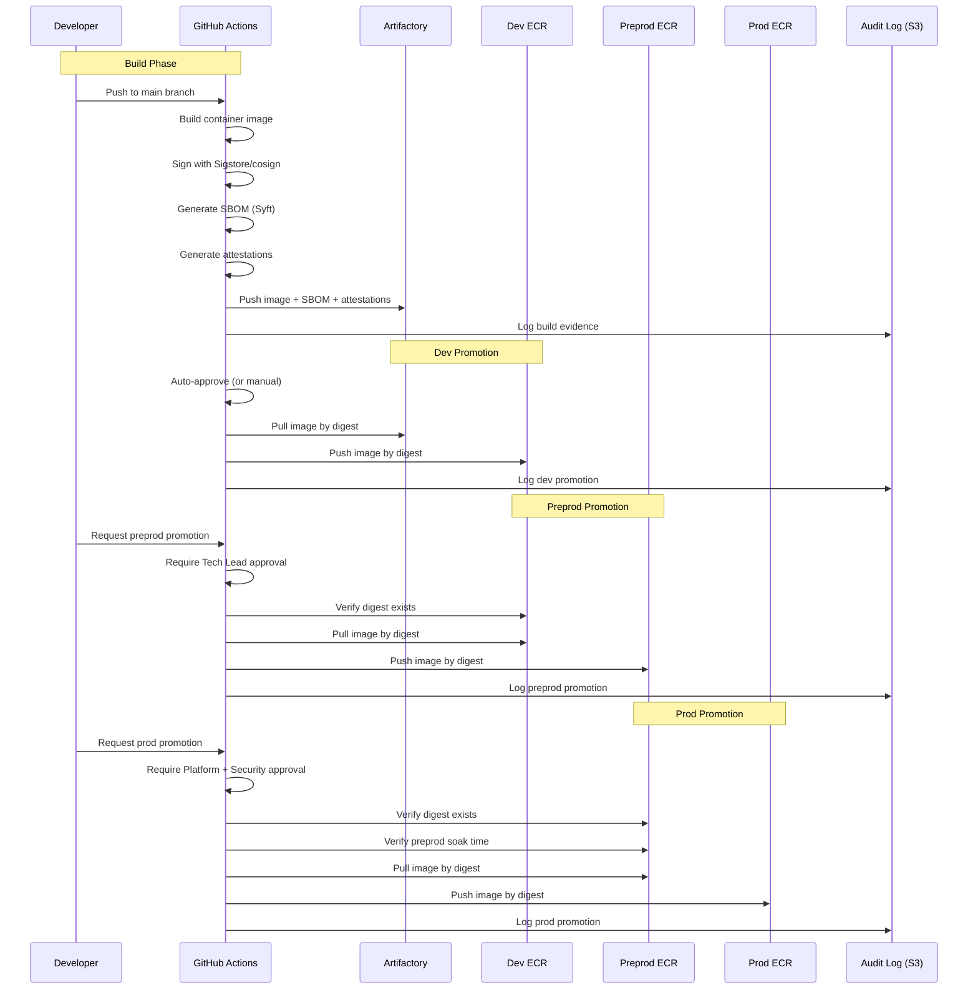

# Artifactory → ECR Promotion Design

## Overview

This document defines the artifact promotion flow from Artifactory (source of truth) to per-account ECR repositories. All promotions are **copy by digest**, ensuring byte-for-byte identical artifacts across environments.

---

## Promotion Flow Diagram



---

## Digest-Copy Implementation

### Why Digest (Not Tag)

| Aspect | Tag-Based | Digest-Based |
|--------|-----------|--------------|
| **Immutability** | ❌ Tags can be overwritten | ✅ Digest is content hash |
| **Auditability** | ❌ Same tag, different content | ✅ Digest proves exact content |
| **Rollback** | ❌ "Rollback to v1.2.3" is ambiguous | ✅ "Rollback to sha256:abc..." is exact |
| **Security** | ❌ Tag mutation attacks possible | ✅ Supply chain integrity |

### Digest Format

```
sha256:a3ed95caeb02ffe68cdd9fd84406680ae93d633cb16422d00e8a7c22955b46d4
```

- Always 64 hexadecimal characters
- Represents SHA256 hash of image manifest
- Immutable: same content always produces same digest

---

## GitHub Actions Workflows

### 1. Build and Push to Artifactory

```yaml
# .github/workflows/build.yml
name: Build Agent Container

on:
  push:
    branches: [main]
    paths:
      - 'agents/**'
      - 'Dockerfile'

permissions:
  id-token: write
  contents: read

jobs:
  build:
    runs-on: ubuntu-latest
    outputs:
      digest: ${{ steps.build.outputs.digest }}
      
    steps:
      - uses: actions/checkout@v4

      - name: Configure Artifactory credentials
        uses: jfrog/setup-jfrog-cli@v3
        with:
          oidc-provider-name: github-oidc
          oidc-audience: jfrog-artifactory

      - name: Build container image
        id: build
        run: |
          IMAGE_TAG="${{ github.sha }}"
          docker build -t agentcore-agent:${IMAGE_TAG} .
          DIGEST=$(docker inspect --format='{{index .RepoDigests 0}}' agentcore-agent:${IMAGE_TAG} | cut -d'@' -f2)
          echo "digest=${DIGEST}" >> $GITHUB_OUTPUT

      - name: Sign image with Sigstore
        uses: sigstore/cosign-installer@v3
        
      - name: Sign the image
        run: |
          cosign sign --yes \
            --oidc-issuer=https://token.actions.githubusercontent.com \
            artifactory.bank.com/agentcore/agent@${{ steps.build.outputs.digest }}

      - name: Generate SBOM
        uses: anchore/sbom-action@v0
        with:
          image: artifactory.bank.com/agentcore/agent@${{ steps.build.outputs.digest }}
          output-file: sbom.spdx.json
          format: spdx-json

      - name: Attest SBOM
        run: |
          cosign attest --yes \
            --predicate sbom.spdx.json \
            --type spdxjson \
            artifactory.bank.com/agentcore/agent@${{ steps.build.outputs.digest }}

      - name: Push to Artifactory
        run: |
          docker push artifactory.bank.com/agentcore/agent@${{ steps.build.outputs.digest }}

      - name: Store build evidence
        uses: aws-actions/configure-aws-credentials@v4
        with:
          role-to-assume: arn:aws:iam::999999999999:role/github-actions-audit
          aws-region: us-east-1
          
      - name: Upload evidence to S3
        run: |
          EVIDENCE_KEY="builds/${{ github.repository }}/${{ github.sha }}"
          aws s3 cp sbom.spdx.json s3://bank-audit-evidence/${EVIDENCE_KEY}/sbom.spdx.json
          
          # Create build manifest
          cat > build-manifest.json << EOF
          {
            "repository": "${{ github.repository }}",
            "commit": "${{ github.sha }}",
            "digest": "${{ steps.build.outputs.digest }}",
            "timestamp": "$(date -u +%Y-%m-%dT%H:%M:%SZ)",
            "actor": "${{ github.actor }}",
            "workflow": "${{ github.workflow }}",
            "run_id": "${{ github.run_id }}"
          }
          EOF
          aws s3 cp build-manifest.json s3://bank-audit-evidence/${EVIDENCE_KEY}/build-manifest.json
```

### 2. Promote to Dev ECR

```yaml
# .github/workflows/promote-dev.yml
name: Promote to Dev

on:
  workflow_dispatch:
    inputs:
      digest:
        description: 'Image digest to promote (sha256:...)'
        required: true
        type: string

permissions:
  id-token: write
  contents: read

jobs:
  promote:
    runs-on: ubuntu-latest
    environment: dev  # Optional approval gate
    
    steps:
      - name: Validate digest format
        run: |
          if [[ ! "${{ inputs.digest }}" =~ ^sha256:[a-f0-9]{64}$ ]]; then
            echo "Invalid digest format"
            exit 1
          fi

      - name: Configure Artifactory credentials
        uses: jfrog/setup-jfrog-cli@v3
        with:
          oidc-provider-name: github-oidc

      - name: Configure AWS credentials (Dev)
        uses: aws-actions/configure-aws-credentials@v4
        with:
          role-to-assume: arn:aws:iam::111111111111:role/github-actions-ecr-push
          aws-region: us-east-1

      - name: Verify image exists in Artifactory
        run: |
          crane manifest artifactory.bank.com/agentcore/agent@${{ inputs.digest }}

      - name: Verify signature
        run: |
          cosign verify \
            --certificate-identity-regexp=".*github.com/bank/agentcore.*" \
            --certificate-oidc-issuer=https://token.actions.githubusercontent.com \
            artifactory.bank.com/agentcore/agent@${{ inputs.digest }}

      - name: Copy image to Dev ECR
        run: |
          aws ecr get-login-password --region us-east-1 | \
            crane auth login 111111111111.dkr.ecr.us-east-1.amazonaws.com --username AWS --password-stdin
          
          crane copy \
            artifactory.bank.com/agentcore/agent@${{ inputs.digest }} \
            111111111111.dkr.ecr.us-east-1.amazonaws.com/agentcore/agent@${{ inputs.digest }}

      - name: Log promotion
        run: |
          cat > promotion-evidence.json << EOF
          {
            "source": "artifactory.bank.com/agentcore/agent",
            "destination": "111111111111.dkr.ecr.us-east-1.amazonaws.com/agentcore/agent",
            "digest": "${{ inputs.digest }}",
            "environment": "dev",
            "timestamp": "$(date -u +%Y-%m-%dT%H:%M:%SZ)",
            "actor": "${{ github.actor }}",
            "run_id": "${{ github.run_id }}",
            "approvers": []
          }
          EOF
          aws s3 cp promotion-evidence.json \
            s3://bank-audit-evidence/promotions/dev/${{ inputs.digest }}/promotion.json
```

### 3. Promote to Preprod ECR (Requires Approval)

```yaml
# .github/workflows/promote-preprod.yml
name: Promote to Preprod

on:
  workflow_dispatch:
    inputs:
      digest:
        description: 'Image digest to promote (sha256:...)'
        required: true
        type: string

permissions:
  id-token: write
  contents: read

jobs:
  verify-dev-deployment:
    runs-on: ubuntu-latest
    outputs:
      deployed_at: ${{ steps.check.outputs.deployed_at }}
      
    steps:
      - name: Configure AWS credentials (Dev)
        uses: aws-actions/configure-aws-credentials@v4
        with:
          role-to-assume: arn:aws:iam::111111111111:role/github-actions-readonly
          aws-region: us-east-1

      - name: Verify digest exists in Dev ECR
        id: check
        run: |
          # Verify image exists
          aws ecr describe-images \
            --repository-name agentcore/agent \
            --image-ids imageDigest=${{ inputs.digest }} \
            --query 'imageDetails[0].imagePushedAt' \
            --output text > deployed_at.txt
          
          echo "deployed_at=$(cat deployed_at.txt)" >> $GITHUB_OUTPUT

  promote:
    needs: verify-dev-deployment
    runs-on: ubuntu-latest
    environment: 
      name: preprod
      # Requires approval from tech-leads team
    
    steps:
      - name: Validate digest format
        run: |
          if [[ ! "${{ inputs.digest }}" =~ ^sha256:[a-f0-9]{64}$ ]]; then
            echo "Invalid digest format"
            exit 1
          fi

      - name: Configure AWS credentials (Dev - source)
        id: dev-creds
        uses: aws-actions/configure-aws-credentials@v4
        with:
          role-to-assume: arn:aws:iam::111111111111:role/github-actions-ecr-pull
          aws-region: us-east-1
          output-credentials: true

      - name: Configure AWS credentials (Preprod - destination)
        uses: aws-actions/configure-aws-credentials@v4
        with:
          role-to-assume: arn:aws:iam::222222222222:role/github-actions-ecr-push
          aws-region: us-east-1

      - name: Copy image from Dev to Preprod ECR
        run: |
          # Login to Dev ECR (source)
          aws ecr get-login-password --region us-east-1 | \
            crane auth login 111111111111.dkr.ecr.us-east-1.amazonaws.com --username AWS --password-stdin
          
          # Login to Preprod ECR (destination)
          aws ecr get-login-password --region us-east-1 | \
            crane auth login 222222222222.dkr.ecr.us-east-1.amazonaws.com --username AWS --password-stdin
          
          crane copy \
            111111111111.dkr.ecr.us-east-1.amazonaws.com/agentcore/agent@${{ inputs.digest }} \
            222222222222.dkr.ecr.us-east-1.amazonaws.com/agentcore/agent@${{ inputs.digest }}

      - name: Log promotion with approvers
        run: |
          # Fetch approvers from GitHub API
          APPROVERS=$(gh api \
            /repos/${{ github.repository }}/actions/runs/${{ github.run_id }}/approvals \
            --jq '[.[] | .user.login]')
          
          cat > promotion-evidence.json << EOF
          {
            "source": "111111111111.dkr.ecr.us-east-1.amazonaws.com/agentcore/agent",
            "destination": "222222222222.dkr.ecr.us-east-1.amazonaws.com/agentcore/agent",
            "digest": "${{ inputs.digest }}",
            "environment": "preprod",
            "timestamp": "$(date -u +%Y-%m-%dT%H:%M:%SZ)",
            "actor": "${{ github.actor }}",
            "run_id": "${{ github.run_id }}",
            "approvers": ${APPROVERS},
            "dev_deployed_at": "${{ needs.verify-dev-deployment.outputs.deployed_at }}"
          }
          EOF
          aws s3 cp promotion-evidence.json \
            s3://bank-audit-evidence/promotions/preprod/${{ inputs.digest }}/promotion.json
        env:
          GH_TOKEN: ${{ github.token }}
```

### 4. Promote to Prod ECR (Requires Multiple Approvals)

```yaml
# .github/workflows/promote-prod.yml
name: Promote to Prod

on:
  workflow_dispatch:
    inputs:
      digest:
        description: 'Image digest to promote (sha256:...)'
        required: true
        type: string

permissions:
  id-token: write
  contents: read

jobs:
  verify-preprod-deployment:
    runs-on: ubuntu-latest
    outputs:
      deployed_at: ${{ steps.check.outputs.deployed_at }}
      soak_hours: ${{ steps.check.outputs.soak_hours }}
      
    steps:
      - name: Configure AWS credentials (Preprod)
        uses: aws-actions/configure-aws-credentials@v4
        with:
          role-to-assume: arn:aws:iam::222222222222:role/github-actions-readonly
          aws-region: us-east-1

      - name: Verify digest exists in Preprod ECR and check soak time
        id: check
        run: |
          # Verify image exists and get push time
          DEPLOYED_AT=$(aws ecr describe-images \
            --repository-name agentcore/agent \
            --image-ids imageDigest=${{ inputs.digest }} \
            --query 'imageDetails[0].imagePushedAt' \
            --output text)
          
          echo "deployed_at=${DEPLOYED_AT}" >> $GITHUB_OUTPUT
          
          # Calculate soak time
          DEPLOYED_EPOCH=$(date -d "${DEPLOYED_AT}" +%s)
          NOW_EPOCH=$(date +%s)
          SOAK_HOURS=$(( (NOW_EPOCH - DEPLOYED_EPOCH) / 3600 ))
          
          echo "soak_hours=${SOAK_HOURS}" >> $GITHUB_OUTPUT
          
          # Require minimum 24 hours in preprod
          if [ ${SOAK_HOURS} -lt 24 ]; then
            echo "::error::Image must be in preprod for at least 24 hours. Current: ${SOAK_HOURS} hours"
            exit 1
          fi

  promote:
    needs: verify-preprod-deployment
    runs-on: ubuntu-latest
    environment: 
      name: prod
      # Requires approval from platform-team AND security-team
    
    steps:
      - name: Validate digest format
        run: |
          if [[ ! "${{ inputs.digest }}" =~ ^sha256:[a-f0-9]{64}$ ]]; then
            echo "Invalid digest format"
            exit 1
          fi

      - name: Configure AWS credentials (Preprod - source)
        uses: aws-actions/configure-aws-credentials@v4
        with:
          role-to-assume: arn:aws:iam::222222222222:role/github-actions-ecr-pull
          aws-region: us-east-1

      - name: Configure AWS credentials (Prod - destination)
        uses: aws-actions/configure-aws-credentials@v4
        with:
          role-to-assume: arn:aws:iam::333333333333:role/github-actions-ecr-push
          aws-region: us-east-1

      - name: Final signature verification
        run: |
          cosign verify \
            --certificate-identity-regexp=".*github.com/bank/agentcore.*" \
            --certificate-oidc-issuer=https://token.actions.githubusercontent.com \
            222222222222.dkr.ecr.us-east-1.amazonaws.com/agentcore/agent@${{ inputs.digest }}

      - name: Copy image from Preprod to Prod ECR
        run: |
          crane copy \
            222222222222.dkr.ecr.us-east-1.amazonaws.com/agentcore/agent@${{ inputs.digest }} \
            333333333333.dkr.ecr.us-east-1.amazonaws.com/agentcore/agent@${{ inputs.digest }}

      - name: Log promotion with full audit trail
        run: |
          APPROVERS=$(gh api \
            /repos/${{ github.repository }}/actions/runs/${{ github.run_id }}/approvals \
            --jq '[.[] | {user: .user.login, state: .state, submitted_at: .submitted_at}]')
          
          cat > promotion-evidence.json << EOF
          {
            "source": "222222222222.dkr.ecr.us-east-1.amazonaws.com/agentcore/agent",
            "destination": "333333333333.dkr.ecr.us-east-1.amazonaws.com/agentcore/agent",
            "digest": "${{ inputs.digest }}",
            "environment": "prod",
            "timestamp": "$(date -u +%Y-%m-%dT%H:%M:%SZ)",
            "actor": "${{ github.actor }}",
            "run_id": "${{ github.run_id }}",
            "approvers": ${APPROVERS},
            "preprod_deployed_at": "${{ needs.verify-preprod-deployment.outputs.deployed_at }}",
            "preprod_soak_hours": ${{ needs.verify-preprod-deployment.outputs.soak_hours }}
          }
          EOF
          aws s3 cp promotion-evidence.json \
            s3://bank-audit-evidence/promotions/prod/${{ inputs.digest }}/promotion.json
        env:
          GH_TOKEN: ${{ github.token }}
```

---

## IAM Roles and Policies

### GitHub Actions OIDC Provider (Per Account)

```hcl
# modules/cicd/github_oidc.tf

resource "aws_iam_openid_connect_provider" "github" {
  url             = "https://token.actions.githubusercontent.com"
  client_id_list  = ["sts.amazonaws.com"]
  thumbprint_list = ["6938fd4d98bab03faadb97b34396831e3780aea1"]
  
  tags = var.tags
}
```

### ECR Push Role (Per Account)

```hcl
# modules/ecr/iam.tf

resource "aws_iam_role" "github_actions_ecr_push" {
  name = "${var.name_prefix}-github-ecr-push"
  
  assume_role_policy = jsonencode({
    Version = "2012-10-17"
    Statement = [
      {
        Effect = "Allow"
        Principal = {
          Federated = aws_iam_openid_connect_provider.github.arn
        }
        Action = "sts:AssumeRoleWithWebIdentity"
        Condition = {
          StringEquals = {
            "token.actions.githubusercontent.com:aud" = "sts.amazonaws.com"
          }
          StringLike = {
            "token.actions.githubusercontent.com:sub" = "repo:bank/agentcore:*"
          }
        }
      }
    ]
  })
  
  tags = var.tags
}

resource "aws_iam_role_policy" "github_actions_ecr_push" {
  name = "ecr-push-policy"
  role = aws_iam_role.github_actions_ecr_push.id
  
  policy = jsonencode({
    Version = "2012-10-17"
    Statement = [
      {
        Sid    = "ECRAuth"
        Effect = "Allow"
        Action = [
          "ecr:GetAuthorizationToken"
        ]
        Resource = "*"
      },
      {
        Sid    = "ECRPush"
        Effect = "Allow"
        Action = [
          "ecr:BatchCheckLayerAvailability",
          "ecr:InitiateLayerUpload",
          "ecr:UploadLayerPart",
          "ecr:CompleteLayerUpload",
          "ecr:PutImage"
        ]
        Resource = [
          for repo in aws_ecr_repository.agent : repo.arn
        ]
      }
    ]
  })
}
```

### ECR Pull Role (For Cross-Account Copy)

```hcl
resource "aws_iam_role" "github_actions_ecr_pull" {
  name = "${var.name_prefix}-github-ecr-pull"
  
  assume_role_policy = jsonencode({
    Version = "2012-10-17"
    Statement = [
      {
        Effect = "Allow"
        Principal = {
          Federated = aws_iam_openid_connect_provider.github.arn
        }
        Action = "sts:AssumeRoleWithWebIdentity"
        Condition = {
          StringEquals = {
            "token.actions.githubusercontent.com:aud" = "sts.amazonaws.com"
          }
          StringLike = {
            "token.actions.githubusercontent.com:sub" = "repo:bank/agentcore:*"
          }
        }
      }
    ]
  })
  
  tags = var.tags
}

resource "aws_iam_role_policy" "github_actions_ecr_pull" {
  name = "ecr-pull-policy"
  role = aws_iam_role.github_actions_ecr_pull.id
  
  policy = jsonencode({
    Version = "2012-10-17"
    Statement = [
      {
        Sid    = "ECRAuth"
        Effect = "Allow"
        Action = "ecr:GetAuthorizationToken"
        Resource = "*"
      },
      {
        Sid    = "ECRPull"
        Effect = "Allow"
        Action = [
          "ecr:BatchGetImage",
          "ecr:GetDownloadUrlForLayer"
        ]
        Resource = [
          for repo in aws_ecr_repository.agent : repo.arn
        ]
      }
    ]
  })
}
```

---

## Preventing Unapproved Digests

### 1. ECR Repository Policy

```hcl
resource "aws_ecr_repository_policy" "agent" {
  for_each   = var.agents
  repository = aws_ecr_repository.agent[each.key].name
  
  policy = jsonencode({
    Version = "2012-10-17"
    Statement = [
      {
        Sid    = "AllowGitHubActionsPush"
        Effect = "Allow"
        Principal = {
          AWS = aws_iam_role.github_actions_ecr_push.arn
        }
        Action = [
          "ecr:BatchCheckLayerAvailability",
          "ecr:InitiateLayerUpload",
          "ecr:UploadLayerPart",
          "ecr:CompleteLayerUpload",
          "ecr:PutImage"
        ]
      },
      {
        Sid    = "AllowRuntimePull"
        Effect = "Allow"
        Principal = {
          AWS = var.execution_role_arns
        }
        Action = [
          "ecr:BatchGetImage",
          "ecr:GetDownloadUrlForLayer"
        ]
      }
    ]
  })
}
```

### 2. Terraform Variable Validation

```hcl
variable "agents" {
  # ... type definition ...

  validation {
    condition = alltrue([
      for k, v in var.agents : can(regex("^sha256:[a-f0-9]{64}$", v.runtime_version_digest))
    ])
    error_message = "All agent runtime_version_digest values must be valid SHA256 digests."
  }
}
```

### 3. ECR Image Scanning

```hcl
resource "aws_ecr_repository" "agent" {
  for_each = var.agents
  name     = "agentcore/${each.key}"
  
  image_scanning_configuration {
    scan_on_push = true
  }
  
  # Require signed images (when supported)
  image_tag_mutability = "IMMUTABLE"
  
  tags = var.tags
}
```

---

## Audit Trail and Evidence

### Evidence Storage Structure

```
s3://bank-audit-evidence/
├── builds/
│   └── bank/agentcore/
│       └── <commit-sha>/
│           ├── build-manifest.json
│           ├── sbom.spdx.json
│           └── signature.json
├── promotions/
│   ├── dev/
│   │   └── <digest>/
│   │       └── promotion.json
│   ├── preprod/
│   │   └── <digest>/
│   │       └── promotion.json
│   └── prod/
│       └── <digest>/
│           └── promotion.json
└── deployments/
    ├── dev/
    ├── preprod/
    └── prod/
```

### Evidence Retention Policy

```hcl
resource "aws_s3_bucket_lifecycle_configuration" "audit_evidence" {
  bucket = aws_s3_bucket.audit_evidence.id
  
  rule {
    id     = "production-evidence"
    status = "Enabled"
    
    filter {
      prefix = "promotions/prod/"
    }
    
    # Keep production evidence for 7 years (regulatory requirement)
    expiration {
      days = 2555  # 7 years
    }
    
    # Move to Glacier after 1 year
    transition {
      days          = 365
      storage_class = "GLACIER"
    }
  }
  
  rule {
    id     = "non-prod-evidence"
    status = "Enabled"
    
    filter {
      prefix = "promotions/dev/"
    }
    
    expiration {
      days = 365  # 1 year
    }
  }
}
```

---

## Why This Design

### Why Copy by Digest
- **Chosen**: All promotions use immutable SHA256 digests
- **Why**: Cryptographic guarantee of content integrity; audit trail proves exact artifact; prevents tag mutation
- **Why not tags**: Tags are mutable; could be overwritten between environments; no integrity guarantee

### Why Separate Workflows per Environment
- **Chosen**: Individual workflow files for each promotion step
- **Why**: Clear approval gates; independent audit logs; simpler to review; matches organizational boundaries
- **Why not single workflow**: Harder to gate approvals; monolithic; harder to audit

### Why Soak Time Requirement
- **Chosen**: Minimum 24 hours in preprod before prod promotion
- **Why**: Catches delayed failures; allows monitoring to detect issues; regulatory expectation for change control
- **Why not skip**: Risk of promoting problematic artifacts; no time for issue detection

### Why Store Evidence in S3
- **Chosen**: Dedicated audit-evidence bucket with lifecycle policies
- **Why**: Durable; auditable; searchable; integrates with existing compliance tools; S3 Object Lock available
- **Why not CloudWatch/CloudTrail alone**: Harder to query; log retention limits; not optimized for structured evidence


