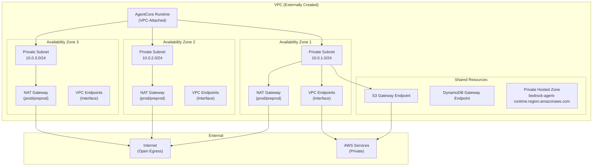
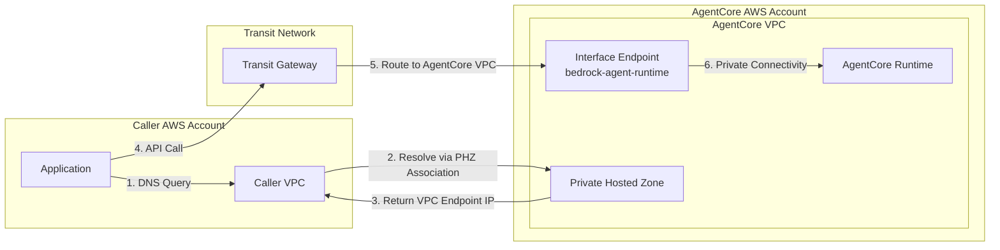

# Network Design

## Overview

This document defines the network architecture for the AgentCore platform, including VPC integration, NAT strategy, VPC endpoints, and cross-account connectivity patterns.

---

## Network Architecture Diagram



---

## Subnet Input Shape

The VPC is created outside this module. The module requires the following input structure:

```hcl
variable "vpc_config" {
  description = "VPC configuration - VPC is created outside this module"
  type = object({
    # VPC identifier
    vpc_id = string
    
    # Private subnets mapped by a unique key (e.g., AZ name or logical name)
    private_subnet_ids = map(object({
      subnet_id         = string
      availability_zone = string
      cidr_block        = string
    }))
    
    # Security groups for different purposes
    security_group_ids = object({
      agentcore_runtime   = string  # For AgentCore runtime attachment
      vpc_endpoints       = string  # For VPC endpoint ENIs
      nat_gateway_egress  = string  # For NAT gateway routing
    })
    
    # Route tables by AZ for NAT gateway route injection
    route_table_ids = map(string)  # Key = AZ, value = route table ID
  })
}
```

### Example Input

```hcl
vpc_config = {
  vpc_id = "vpc-0abc123def456789"
  
  private_subnet_ids = {
    "us-east-1a" = {
      subnet_id         = "subnet-0aaa111"
      availability_zone = "us-east-1a"
      cidr_block        = "10.0.1.0/24"
    }
    "us-east-1b" = {
      subnet_id         = "subnet-0bbb222"
      availability_zone = "us-east-1b"
      cidr_block        = "10.0.2.0/24"
    }
    "us-east-1c" = {
      subnet_id         = "subnet-0ccc333"
      availability_zone = "us-east-1c"
      cidr_block        = "10.0.3.0/24"
    }
  }
  
  security_group_ids = {
    agentcore_runtime   = "sg-runtime123"
    vpc_endpoints       = "sg-vpce456"
    nat_gateway_egress  = "sg-nat789"
  }
  
  route_table_ids = {
    "us-east-1a" = "rtb-0aaa"
    "us-east-1b" = "rtb-0bbb"
    "us-east-1c" = "rtb-0ccc"
  }
}
```

---

## NAT Gateway Strategy

### Logic

```hcl
locals {
  # Determine NAT Gateway count based on mode
  nat_gateway_count = var.scale_profile.nat_mode == "per_az" ? local.az_count : 1
  
  # Determine which AZs get NAT Gateways
  nat_gateway_azs = var.scale_profile.nat_mode == "per_az" ? (
    local.availability_zones
  ) : (
    [local.availability_zones[0]]  # First AZ only for single NAT
  )
}
```

### Implementation

```hcl
# modules/network/nat.tf

# Elastic IPs for NAT Gateways
resource "aws_eip" "nat" {
  for_each = toset(var.nat_gateway_azs)
  
  domain = "vpc"
  
  tags = merge(var.tags, {
    Name = "${var.name_prefix}-nat-eip-${each.key}"
  })
}

# NAT Gateways (one per configured AZ)
resource "aws_nat_gateway" "this" {
  for_each = toset(var.nat_gateway_azs)
  
  allocation_id = aws_eip.nat[each.key].id
  subnet_id     = var.public_subnet_ids[each.key]  # NAT in public subnet
  
  tags = merge(var.tags, {
    Name = "${var.name_prefix}-nat-${each.key}"
  })
  
  lifecycle {
    # Enforce production HA requirement
    precondition {
      condition = !(
        var.environment == "prod" && 
        var.nat_mode != "per_az"
      )
      error_message = "Production must use NAT per AZ for HA."
    }
  }
}

# Routes to NAT Gateway
resource "aws_route" "nat" {
  for_each = var.route_table_ids
  
  route_table_id         = each.value
  destination_cidr_block = "0.0.0.0/0"
  
  # Route to NAT in same AZ (if per_az) or single NAT (if single mode)
  nat_gateway_id = var.nat_mode == "per_az" ? (
    aws_nat_gateway.this[each.key].id
  ) : (
    aws_nat_gateway.this[var.nat_gateway_azs[0]].id
  )
}
```

### Environment Comparison

| Aspect | Dev (single) | Preprod (per_az) | Prod (per_az) |
|--------|--------------|------------------|---------------|
| **NAT Gateway Count** | 1 | 3 | 3 |
| **Cost (monthly approx)** | ~$45 | ~$135 | ~$135 |
| **AZ Failure Impact** | All egress lost | Affected AZ only | Affected AZ only |
| **Cross-AZ Data Transfer** | Yes (cost) | No | No |

---

## VPC Endpoints

### Required Endpoints

```hcl
locals {
  # Gateway endpoints (free, always deploy)
  gateway_endpoints = toset([
    "s3",
    "dynamodb"
  ])
  
  # Interface endpoints (cost per AZ, optimize based on scale_profile)
  interface_endpoints = toset([
    # AgentCore / Bedrock
    "bedrock-agent-runtime",
    "bedrock-runtime",
    "bedrock",
    
    # Container Registry
    "ecr.api",
    "ecr.dkr",
    
    # Observability
    "logs",
    "monitoring",
    "xray",
    
    # Secrets and Configuration
    "secretsmanager",
    "ssm",
    "ssmmessages",
    
    # Security
    "kms",
    "sts"
  ])
}
```

### Implementation

```hcl
# modules/network/vpc_endpoints.tf

# Gateway Endpoints (S3, DynamoDB)
resource "aws_vpc_endpoint" "gateway" {
  for_each = local.gateway_endpoints
  
  vpc_id            = var.vpc_id
  service_name      = "com.amazonaws.${var.aws_region}.${each.key}"
  vpc_endpoint_type = "Gateway"
  
  route_table_ids = values(var.route_table_ids)
  
  tags = merge(var.tags, {
    Name = "${var.name_prefix}-vpce-${each.key}"
  })
}

# Interface Endpoints
resource "aws_vpc_endpoint" "interface" {
  for_each = local.interface_endpoints
  
  vpc_id              = var.vpc_id
  service_name        = "com.amazonaws.${var.aws_region}.${each.key}"
  vpc_endpoint_type   = "Interface"
  private_dns_enabled = true
  
  # Deploy to configured number of AZs
  subnet_ids = var.vpc_endpoint_subnet_ids
  
  security_group_ids = [var.security_group_ids.vpc_endpoints]
  
  tags = merge(var.tags, {
    Name = "${var.name_prefix}-vpce-${each.key}"
  })
}
```

### AZ Count Optimization

Interface VPC endpoints incur hourly charges per AZ. The `vpc_endpoint_az_count` in `scale_profile` controls this:

```hcl
locals {
  # Limit interface endpoints to configured AZ count
  vpc_endpoint_subnet_ids = slice(
    [for az in local.availability_zones : local.subnets_by_az[az]],
    0,
    min(var.scale_profile.vpc_endpoint_az_count, local.az_count)
  )
}
```

| Environment | vpc_endpoint_az_count | Monthly Cost (12 endpoints × $7.30/AZ) |
|-------------|----------------------|----------------------------------------|
| Dev | 1 | ~$88 |
| Preprod | 2 | ~$175 |
| Prod | 3 | ~$263 |

---

## Cross-Account Invocation Pattern

### Architecture



### Private Hosted Zone Configuration

```hcl
# modules/network/private_dns.tf

# Private Hosted Zone for AgentCore
resource "aws_route53_zone" "agentcore" {
  name = "bedrock-agent-runtime.${var.aws_region}.amazonaws.com"
  
  vpc {
    vpc_id = var.vpc_id
  }
  
  tags = merge(var.tags, {
    Name = "${var.name_prefix}-phz-agentcore"
  })
  
  lifecycle {
    ignore_changes = [vpc]  # Managed via associations
  }
}

# Alias record pointing to VPC endpoint
resource "aws_route53_record" "agentcore" {
  zone_id = aws_route53_zone.agentcore.zone_id
  name    = "bedrock-agent-runtime.${var.aws_region}.amazonaws.com"
  type    = "A"
  
  alias {
    name                   = aws_vpc_endpoint.interface["bedrock-agent-runtime"].dns_entry[0]["dns_name"]
    zone_id                = aws_vpc_endpoint.interface["bedrock-agent-runtime"].dns_entry[0]["hosted_zone_id"]
    evaluate_target_health = true
  }
}

# Cross-account PHZ associations
resource "aws_route53_vpc_association_authorization" "caller" {
  for_each = var.cross_account_access.enabled ? var.cross_account_access.allowed_caller_accounts : toset([])
  
  zone_id = aws_route53_zone.agentcore.zone_id
  vpc_id  = each.value  # Caller VPC ID (passed as input)
}
```

### Caller Account Configuration

```hcl
# In caller account (separate Terraform)

resource "aws_route53_zone_association" "agentcore" {
  zone_id = data.aws_route53_zone.agentcore.zone_id  # From AgentCore account
  vpc_id  = aws_vpc.caller.id
}
```

---

## Security Group Rules

### AgentCore Runtime Security Group

```hcl
# modules/network/security_groups.tf

# Rules for AgentCore runtime (reference - created externally)
# This documents expected configuration

# Inbound: Allow from VPC endpoints
# - HTTPS (443) from vpc_endpoints security group

# Outbound: Allow to VPC endpoints and NAT
# - HTTPS (443) to vpc_endpoints security group
# - HTTPS (443) to NAT gateway (for open egress)
```

### VPC Endpoints Security Group

```hcl
# Inbound: Allow from private subnets
resource "aws_security_group_rule" "vpce_ingress" {
  type              = "ingress"
  from_port         = 443
  to_port           = 443
  protocol          = "tcp"
  cidr_blocks       = [for subnet in var.private_subnet_ids : subnet.cidr_block]
  security_group_id = var.security_group_ids.vpc_endpoints
  description       = "Allow HTTPS from private subnets"
}

# No outbound required for interface endpoints (ENI responds to inbound)
```

---

## Network Submodule Interface

### Variables

```hcl
# modules/network/variables.tf

variable "environment" {
  description = "Environment identifier"
  type        = string
}

variable "name_prefix" {
  description = "Prefix for resource naming"
  type        = string
}

variable "aws_region" {
  description = "AWS region"
  type        = string
}

variable "vpc_id" {
  description = "VPC ID (created externally)"
  type        = string
}

variable "private_subnet_ids" {
  description = "Map of private subnet configurations"
  type = map(object({
    subnet_id         = string
    availability_zone = string
    cidr_block        = string
  }))
}

variable "public_subnet_ids" {
  description = "Map of public subnet IDs by AZ (for NAT gateway placement)"
  type        = map(string)
}

variable "security_group_ids" {
  description = "Security group IDs for various purposes"
  type = object({
    agentcore_runtime   = string
    vpc_endpoints       = string
    nat_gateway_egress  = string
  })
}

variable "route_table_ids" {
  description = "Route table IDs by AZ"
  type        = map(string)
}

variable "availability_zones" {
  description = "List of availability zones"
  type        = list(string)
}

variable "subnets_by_az" {
  description = "Map of AZ to subnet ID"
  type        = map(string)
}

variable "vpc_endpoint_subnet_ids" {
  description = "Subnet IDs for VPC endpoints (AZ-limited)"
  type        = list(string)
}

variable "nat_mode" {
  description = "NAT gateway mode: per_az or single"
  type        = string
}

variable "nat_gateway_azs" {
  description = "AZs to deploy NAT gateways in"
  type        = list(string)
}

variable "gateway_endpoints" {
  description = "Set of gateway endpoint services"
  type        = set(string)
}

variable "interface_endpoints" {
  description = "Set of interface endpoint services"
  type        = set(string)
}

variable "cross_account_access" {
  description = "Cross-account access configuration"
  type = object({
    enabled                 = bool
    allowed_caller_accounts = set(string)
    allowed_caller_roles    = map(set(string))
  })
}

variable "tags" {
  description = "Tags to apply to resources"
  type        = map(string)
}
```

### Outputs

```hcl
# modules/network/outputs.tf

output "vpc_endpoint_ids" {
  description = "Map of service name to VPC endpoint ID"
  value = merge(
    { for k, v in aws_vpc_endpoint.gateway : k => v.id },
    { for k, v in aws_vpc_endpoint.interface : k => v.id }
  )
}

output "vpc_endpoint_arns" {
  description = "Map of service name to VPC endpoint ARN"
  value = merge(
    { for k, v in aws_vpc_endpoint.gateway : k => v.arn },
    { for k, v in aws_vpc_endpoint.interface : k => v.arn }
  )
}

output "nat_gateway_ids" {
  description = "List of NAT gateway IDs"
  value       = [for nat in aws_nat_gateway.this : nat.id]
}

output "nat_gateway_public_ips" {
  description = "Map of AZ to NAT gateway public IP"
  value       = { for k, v in aws_nat_gateway.this : k => aws_eip.nat[k].public_ip }
}

output "private_hosted_zone_id" {
  description = "Route 53 private hosted zone ID for AgentCore"
  value       = aws_route53_zone.agentcore.zone_id
}

output "private_hosted_zone_name" {
  description = "Route 53 private hosted zone name"
  value       = aws_route53_zone.agentcore.name
}
```

---

## Why This Design

### Why VPC is External
- **Chosen**: VPC created outside this module; module accepts VPC inputs
- **Why**: VPC lifecycle differs from AgentCore; enables shared VPC patterns; separation of concerns; VPC may host other workloads
- **Why not create VPC in module**: Couples VPC lifecycle to AgentCore; harder to share VPC; would duplicate VPC per deployment

### Why NAT per AZ in Production
- **Chosen**: Three NAT Gateways (one per AZ) in prod/preprod
- **Why**: AZ-isolated failures; no cross-AZ dependency; eliminates single point of failure; meets HA SLAs
- **Why not single NAT**: AZ failure impacts all egress; cross-AZ data transfer costs; unacceptable for production

### Why Private DNS for Cross-Account
- **Chosen**: Private Hosted Zone with VPC associations
- **Why**: Standard AWS SDK works unchanged; caller resolves to VPC endpoint; no code changes required; auditable DNS resolution
- **Why not endpoint URL directly**: Requires code changes; non-standard SDK configuration; harder to audit

### Why Gateway Endpoints for S3/DynamoDB
- **Chosen**: Gateway (not interface) endpoints for S3 and DynamoDB
- **Why**: Free; route table based; higher throughput; AWS recommended for these services
- **Why not interface endpoints**: Unnecessary cost; lower throughput; no benefit for S3/DynamoDB

