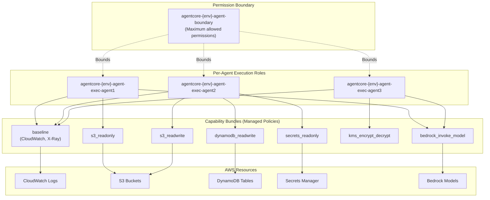

# IAM Model

## Overview

This document defines the IAM architecture for AgentCore, including execution roles, capability bundles, and permission boundaries. The design follows least-privilege principles with per-agent isolation.

---

## IAM Architecture Diagram



---

## Execution Role Structure

### One Role Per Agent Per Environment

```hcl
# modules/iam/execution_roles.tf

resource "aws_iam_role" "agent_execution" {
  for_each = var.agents
  
  name = "${var.name_prefix}-agent-exec-${each.key}"
  
  # Permission boundary - limits maximum permissions
  permissions_boundary = aws_iam_policy.permission_boundary.arn
  
  assume_role_policy = jsonencode({
    Version = "2012-10-17"
    Statement = [
      {
        Effect = "Allow"
        Principal = {
          Service = "bedrock.amazonaws.com"
        }
        Action = "sts:AssumeRole"
        Condition = {
          StringEquals = {
            "aws:SourceAccount" = var.aws_account_id
          }
          ArnLike = {
            "aws:SourceArn" = "arn:aws:bedrock:${var.aws_region}:${var.aws_account_id}:agent/*"
          }
        }
      }
    ]
  })
  
  tags = merge(var.tags, {
    AgentName = each.value.name
    AgentKey  = each.key
  })
}

# Attach capability bundles to each role
resource "aws_iam_role_policy_attachment" "capability_bundles" {
  for_each = {
    for pair in flatten([
      for agent_key, agent in var.agents : [
        for bundle in agent.capability_bundles : {
          key       = "${agent_key}-${bundle}"
          agent_key = agent_key
          bundle    = bundle
        }
      ]
    ]) : pair.key => pair
  }
  
  role       = aws_iam_role.agent_execution[each.value.agent_key].name
  policy_arn = aws_iam_policy.capability_bundle[each.value.bundle].arn
}

# Attach custom policies if specified
resource "aws_iam_role_policy_attachment" "custom_policies" {
  for_each = {
    for pair in flatten([
      for agent_key, agent in var.agents : [
        for policy_arn in agent.custom_policy_arns : {
          key        = "${agent_key}-${md5(policy_arn)}"
          agent_key  = agent_key
          policy_arn = policy_arn
        }
      ]
    ]) : pair.key => pair
  }
  
  role       = aws_iam_role.agent_execution[each.value.agent_key].name
  policy_arn = each.value.policy_arn
}
```

---

## Capability Bundles

### Baseline Bundle (Always Attached)

```hcl
# modules/iam/capability_bundles.tf

resource "aws_iam_policy" "capability_bundle" {
  for_each = local.capability_bundle_definitions
  
  name   = "${var.name_prefix}-capability-${each.key}"
  policy = jsonencode(each.value)
  
  tags = merge(var.tags, {
    CapabilityBundle = each.key
  })
}

locals {
  capability_bundle_definitions = {
    # =========================================================================
    # BASELINE - Required for all agents
    # =========================================================================
    baseline = {
      Version = "2012-10-17"
      Statement = [
        {
          Sid    = "CloudWatchLogs"
          Effect = "Allow"
          Action = [
            "logs:CreateLogStream",
            "logs:PutLogEvents",
            "logs:DescribeLogStreams"
          ]
          Resource = [
            "arn:aws:logs:${var.aws_region}:${var.aws_account_id}:log-group:/aws/agentcore/${var.environment}/*"
          ]
        },
        {
          Sid    = "XRayTracing"
          Effect = "Allow"
          Action = [
            "xray:PutTraceSegments",
            "xray:PutTelemetryRecords",
            "xray:GetSamplingRules",
            "xray:GetSamplingTargets"
          ]
          Resource = "*"
        },
        {
          Sid    = "CloudWatchMetrics"
          Effect = "Allow"
          Action = [
            "cloudwatch:PutMetricData"
          ]
          Resource = "*"
          Condition = {
            StringEquals = {
              "cloudwatch:namespace" = "AgentCore/${var.environment}"
            }
          }
        }
      ]
    }

    # =========================================================================
    # S3 READ-ONLY
    # =========================================================================
    s3_readonly = {
      Version = "2012-10-17"
      Statement = [
        {
          Sid    = "S3ReadOnly"
          Effect = "Allow"
          Action = [
            "s3:GetObject",
            "s3:GetObjectVersion",
            "s3:GetObjectTagging",
            "s3:ListBucket",
            "s3:GetBucketLocation"
          ]
          Resource = [
            "arn:aws:s3:::${var.name_prefix}-*",
            "arn:aws:s3:::${var.name_prefix}-*/*"
          ]
        }
      ]
    }

    # =========================================================================
    # S3 READ-WRITE
    # =========================================================================
    s3_readwrite = {
      Version = "2012-10-17"
      Statement = [
        {
          Sid    = "S3ReadWrite"
          Effect = "Allow"
          Action = [
            "s3:GetObject",
            "s3:GetObjectVersion",
            "s3:GetObjectTagging",
            "s3:PutObject",
            "s3:PutObjectTagging",
            "s3:DeleteObject",
            "s3:ListBucket",
            "s3:GetBucketLocation"
          ]
          Resource = [
            "arn:aws:s3:::${var.name_prefix}-*",
            "arn:aws:s3:::${var.name_prefix}-*/*"
          ]
        }
      ]
    }

    # =========================================================================
    # DYNAMODB READ-ONLY
    # =========================================================================
    dynamodb_readonly = {
      Version = "2012-10-17"
      Statement = [
        {
          Sid    = "DynamoDBReadOnly"
          Effect = "Allow"
          Action = [
            "dynamodb:GetItem",
            "dynamodb:BatchGetItem",
            "dynamodb:Query",
            "dynamodb:Scan",
            "dynamodb:DescribeTable"
          ]
          Resource = [
            "arn:aws:dynamodb:${var.aws_region}:${var.aws_account_id}:table/${var.name_prefix}-*",
            "arn:aws:dynamodb:${var.aws_region}:${var.aws_account_id}:table/${var.name_prefix}-*/index/*"
          ]
        }
      ]
    }

    # =========================================================================
    # DYNAMODB READ-WRITE
    # =========================================================================
    dynamodb_readwrite = {
      Version = "2012-10-17"
      Statement = [
        {
          Sid    = "DynamoDBReadWrite"
          Effect = "Allow"
          Action = [
            "dynamodb:GetItem",
            "dynamodb:BatchGetItem",
            "dynamodb:Query",
            "dynamodb:Scan",
            "dynamodb:PutItem",
            "dynamodb:UpdateItem",
            "dynamodb:DeleteItem",
            "dynamodb:BatchWriteItem",
            "dynamodb:DescribeTable"
          ]
          Resource = [
            "arn:aws:dynamodb:${var.aws_region}:${var.aws_account_id}:table/${var.name_prefix}-*",
            "arn:aws:dynamodb:${var.aws_region}:${var.aws_account_id}:table/${var.name_prefix}-*/index/*"
          ]
        }
      ]
    }

    # =========================================================================
    # SECRETS MANAGER READ-ONLY
    # =========================================================================
    secrets_readonly = {
      Version = "2012-10-17"
      Statement = [
        {
          Sid    = "SecretsReadOnly"
          Effect = "Allow"
          Action = [
            "secretsmanager:GetSecretValue",
            "secretsmanager:DescribeSecret"
          ]
          Resource = [
            "arn:aws:secretsmanager:${var.aws_region}:${var.aws_account_id}:secret:${var.name_prefix}/*"
          ]
        }
      ]
    }

    # =========================================================================
    # SSM PARAMETERS READ-ONLY
    # =========================================================================
    ssm_parameters_readonly = {
      Version = "2012-10-17"
      Statement = [
        {
          Sid    = "SSMParametersReadOnly"
          Effect = "Allow"
          Action = [
            "ssm:GetParameter",
            "ssm:GetParameters",
            "ssm:GetParametersByPath"
          ]
          Resource = [
            "arn:aws:ssm:${var.aws_region}:${var.aws_account_id}:parameter/${var.name_prefix}/*"
          ]
        }
      ]
    }

    # =========================================================================
    # KMS ENCRYPT/DECRYPT
    # =========================================================================
    kms_encrypt_decrypt = {
      Version = "2012-10-17"
      Statement = [
        {
          Sid    = "KMSEncryptDecrypt"
          Effect = "Allow"
          Action = [
            "kms:Encrypt",
            "kms:Decrypt",
            "kms:GenerateDataKey",
            "kms:GenerateDataKeyWithoutPlaintext",
            "kms:DescribeKey"
          ]
          Resource = [
            "arn:aws:kms:${var.aws_region}:${var.aws_account_id}:key/*"
          ]
          Condition = {
            StringEquals = {
              "kms:ViaService" = [
                "s3.${var.aws_region}.amazonaws.com",
                "secretsmanager.${var.aws_region}.amazonaws.com",
                "dynamodb.${var.aws_region}.amazonaws.com"
              ]
            }
          }
        }
      ]
    }

    # =========================================================================
    # SNS PUBLISH
    # =========================================================================
    sns_publish = {
      Version = "2012-10-17"
      Statement = [
        {
          Sid    = "SNSPublish"
          Effect = "Allow"
          Action = [
            "sns:Publish"
          ]
          Resource = [
            "arn:aws:sns:${var.aws_region}:${var.aws_account_id}:${var.name_prefix}-*"
          ]
        }
      ]
    }

    # =========================================================================
    # SQS SEND/RECEIVE
    # =========================================================================
    sqs_send_receive = {
      Version = "2012-10-17"
      Statement = [
        {
          Sid    = "SQSSendReceive"
          Effect = "Allow"
          Action = [
            "sqs:SendMessage",
            "sqs:ReceiveMessage",
            "sqs:DeleteMessage",
            "sqs:GetQueueAttributes",
            "sqs:GetQueueUrl"
          ]
          Resource = [
            "arn:aws:sqs:${var.aws_region}:${var.aws_account_id}:${var.name_prefix}-*"
          ]
        }
      ]
    }

    # =========================================================================
    # LAMBDA INVOKE
    # =========================================================================
    lambda_invoke = {
      Version = "2012-10-17"
      Statement = [
        {
          Sid    = "LambdaInvoke"
          Effect = "Allow"
          Action = [
            "lambda:InvokeFunction"
          ]
          Resource = [
            "arn:aws:lambda:${var.aws_region}:${var.aws_account_id}:function:${var.name_prefix}-*"
          ]
        }
      ]
    }

    # =========================================================================
    # BEDROCK INVOKE MODEL
    # =========================================================================
    bedrock_invoke_model = {
      Version = "2012-10-17"
      Statement = [
        {
          Sid    = "BedrockInvokeModel"
          Effect = "Allow"
          Action = [
            "bedrock:InvokeModel",
            "bedrock:InvokeModelWithResponseStream"
          ]
          Resource = [
            "arn:aws:bedrock:${var.aws_region}::foundation-model/*",
            "arn:aws:bedrock:${var.aws_region}:${var.aws_account_id}:provisioned-model/*"
          ]
        }
      ]
    }
  }
}
```

---

## Permission Boundary

### Definition

```hcl
# modules/iam/permission_boundaries.tf

resource "aws_iam_policy" "permission_boundary" {
  name        = var.permission_boundary_name
  description = "Permission boundary for AgentCore execution roles"
  
  policy = jsonencode({
    Version = "2012-10-17"
    Statement = [
      # =====================================================================
      # ALLOWED ACTIONS (Maximum envelope)
      # =====================================================================
      {
        Sid    = "AllowedServices"
        Effect = "Allow"
        Action = [
          # Observability
          "logs:CreateLogStream",
          "logs:PutLogEvents",
          "logs:DescribeLogStreams",
          "cloudwatch:PutMetricData",
          "xray:PutTraceSegments",
          "xray:PutTelemetryRecords",
          "xray:GetSamplingRules",
          "xray:GetSamplingTargets",
          
          # Storage
          "s3:GetObject",
          "s3:GetObjectVersion",
          "s3:GetObjectTagging",
          "s3:PutObject",
          "s3:PutObjectTagging",
          "s3:DeleteObject",
          "s3:ListBucket",
          "s3:GetBucketLocation",
          
          # Database
          "dynamodb:GetItem",
          "dynamodb:BatchGetItem",
          "dynamodb:Query",
          "dynamodb:Scan",
          "dynamodb:PutItem",
          "dynamodb:UpdateItem",
          "dynamodb:DeleteItem",
          "dynamodb:BatchWriteItem",
          "dynamodb:DescribeTable",
          
          # Secrets
          "secretsmanager:GetSecretValue",
          "secretsmanager:DescribeSecret",
          "ssm:GetParameter",
          "ssm:GetParameters",
          "ssm:GetParametersByPath",
          
          # Encryption
          "kms:Encrypt",
          "kms:Decrypt",
          "kms:GenerateDataKey",
          "kms:GenerateDataKeyWithoutPlaintext",
          "kms:DescribeKey",
          
          # Messaging
          "sns:Publish",
          "sqs:SendMessage",
          "sqs:ReceiveMessage",
          "sqs:DeleteMessage",
          "sqs:GetQueueAttributes",
          "sqs:GetQueueUrl",
          
          # Compute
          "lambda:InvokeFunction",
          
          # AI
          "bedrock:InvokeModel",
          "bedrock:InvokeModelWithResponseStream"
        ]
        Resource = "*"
      },
      
      # =====================================================================
      # EXPLICIT DENIES (Cannot be overridden)
      # =====================================================================
      {
        Sid    = "DenyIAMChanges"
        Effect = "Deny"
        Action = [
          "iam:*",
          "organizations:*",
          "account:*"
        ]
        Resource = "*"
      },
      {
        Sid    = "DenySecurityServices"
        Effect = "Deny"
        Action = [
          "cloudtrail:*",
          "config:*",
          "guardduty:*",
          "securityhub:*",
          "inspector:*"
        ]
        Resource = "*"
      },
      {
        Sid    = "DenyNetworkChanges"
        Effect = "Deny"
        Action = [
          "ec2:CreateVpc",
          "ec2:DeleteVpc",
          "ec2:CreateSubnet",
          "ec2:DeleteSubnet",
          "ec2:CreateSecurityGroup",
          "ec2:DeleteSecurityGroup",
          "ec2:AuthorizeSecurityGroupIngress",
          "ec2:AuthorizeSecurityGroupEgress",
          "ec2:RevokeSecurityGroupIngress",
          "ec2:RevokeSecurityGroupEgress"
        ]
        Resource = "*"
      },
      {
        Sid    = "DenyDataExfiltration"
        Effect = "Deny"
        Action = [
          "s3:DeleteBucket",
          "s3:PutBucketPolicy",
          "dynamodb:DeleteTable",
          "rds:DeleteDBInstance",
          "rds:DeleteDBCluster"
        ]
        Resource = "*"
      }
    ]
  })
  
  tags = var.tags
}
```

### Why Permission Boundaries

| Aspect | Without Boundary | With Boundary |
|--------|------------------|---------------|
| **Privilege Escalation** | Role could grant itself more permissions | Maximum envelope enforced |
| **Blast Radius** | Unlimited | Capped at boundary |
| **Compliance** | Requires policy review | Boundary provides baseline assurance |
| **Auditing** | Must check each role | Single boundary to audit |

---

## Cross-Account Trust

### For Cross-Account Invocation

```hcl
# modules/iam/cross_account.tf

# Additional trust policy for cross-account callers
resource "aws_iam_role_policy" "cross_account_invoke" {
  for_each = var.cross_account_access.enabled ? var.agents : {}
  
  name = "cross-account-invoke"
  role = aws_iam_role.agent_execution[each.key].id
  
  policy = jsonencode({
    Version = "2012-10-17"
    Statement = [
      {
        Sid    = "AllowCrossAccountInvoke"
        Effect = "Allow"
        Action = [
          "bedrock:InvokeAgent"
        ]
        Resource = "*"
        Condition = {
          StringEquals = {
            "aws:PrincipalAccount" = var.cross_account_access.allowed_caller_accounts
          }
          ArnLike = {
            "aws:PrincipalArn" = flatten([
              for account, roles in var.cross_account_access.allowed_caller_roles : roles
            ])
          }
        }
      }
    ]
  })
}
```

---

## IAM Submodule Interface

### Variables

```hcl
# modules/iam/variables.tf

variable "environment" {
  description = "Environment identifier"
  type        = string
}

variable "name_prefix" {
  description = "Prefix for resource naming"
  type        = string
}

variable "aws_account_id" {
  description = "AWS account ID"
  type        = string
}

variable "aws_region" {
  description = "AWS region"
  type        = string
}

variable "agents" {
  description = "Normalized agent configurations"
  type = map(object({
    name               = string
    description        = string
    capability_bundles = set(string)
    custom_policy_arns = set(string)
    effective_tags     = map(string)
  }))
}

variable "permission_boundary_name" {
  description = "Name for the permission boundary policy"
  type        = string
}

variable "cross_account_access" {
  description = "Cross-account access configuration"
  type = object({
    enabled                 = bool
    allowed_caller_accounts = set(string)
    allowed_caller_roles    = map(set(string))
  })
}

variable "vpc_endpoint_arns" {
  description = "ARNs of VPC endpoints (from network module)"
  type        = map(string)
}

variable "tags" {
  description = "Tags to apply to resources"
  type        = map(string)
}
```

### Outputs

```hcl
# modules/iam/outputs.tf

output "execution_role_arns" {
  description = "Map of agent key to execution role ARN"
  value       = { for k, v in aws_iam_role.agent_execution : k => v.arn }
}

output "execution_role_names" {
  description = "Map of agent key to execution role name"
  value       = { for k, v in aws_iam_role.agent_execution : k => v.name }
}

output "permission_boundary_arn" {
  description = "ARN of the permission boundary policy"
  value       = aws_iam_policy.permission_boundary.arn
}

output "capability_bundle_arns" {
  description = "Map of capability bundle name to policy ARN"
  value       = { for k, v in aws_iam_policy.capability_bundle : k => v.arn }
}
```

---

## Example Agent Configuration

```hcl
# Example: Different agents with different capability needs

agents = {
  "customer-support-agent" = {
    name        = "Customer Support Agent"
    description = "Handles customer inquiries"
    
    runtime_version_digest = "sha256:abc123..."
    
    # Read customer data, invoke Bedrock for responses
    capability_bundles = [
      "baseline",
      "dynamodb_readonly",
      "bedrock_invoke_model"
    ]
    
    custom_policy_arns = []
    additional_tags = {
      Team = "customer-experience"
    }
  }
  
  "data-analyst-agent" = {
    name        = "Data Analyst Agent"
    description = "Analyzes and stores reports"
    
    runtime_version_digest = "sha256:def456..."
    
    # Read/write S3 for reports, read DynamoDB, use KMS
    capability_bundles = [
      "baseline",
      "s3_readwrite",
      "dynamodb_readonly",
      "kms_encrypt_decrypt",
      "bedrock_invoke_model"
    ]
    
    custom_policy_arns = []
    additional_tags = {
      Team = "data-engineering"
    }
  }
  
  "notification-agent" = {
    name        = "Notification Agent"
    description = "Sends notifications to users"
    
    runtime_version_digest = "sha256:789abc..."
    
    # Read secrets for API keys, publish to SNS
    capability_bundles = [
      "baseline",
      "secrets_readonly",
      "sns_publish",
      "sqs_send_receive"
    ]
    
    custom_policy_arns = [
      # Custom policy for third-party notification API
      "arn:aws:iam::123456789012:policy/custom-notification-api"
    ]
    additional_tags = {
      Team = "platform"
    }
  }
}
```

---

## Why This Design

### Why One Role Per Agent
- **Chosen**: Each agent gets a dedicated execution role
- **Why**: Least privilege per agent; isolated blast radius; per-agent audit trail; enables agent-specific capability tuning
- **Why not shared roles**: Violates least privilege; impossible to audit per-agent; blast radius includes all agents

### Why Capability Bundles
- **Chosen**: Pre-defined managed policies for common capabilities
- **Why**: Standardized permissions; easier to audit; prevents one-off permissions; self-documenting
- **Why not inline policies only**: Harder to audit; prone to copy-paste errors; no standardization

### Why Permission Boundaries
- **Chosen**: Single boundary applied to all agent roles
- **Why**: Caps maximum permissions regardless of attached policies; prevents privilege escalation; single audit point
- **Why not rely on policies alone**: Policies can be modified; no upper limit on permissions; harder to guarantee security posture

### Why Resource-Scoped Permissions
- **Chosen**: All policies scope to specific resource patterns (e.g., `${var.name_prefix}-*`)
- **Why**: Prevents cross-application access; limits blast radius; meets banking least-privilege requirements
- **Why not `Resource: "*"`**: Violates least privilege; increases blast radius; audit red flag


