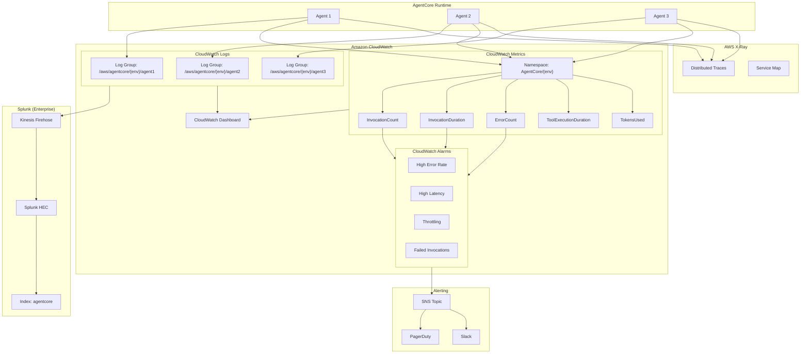
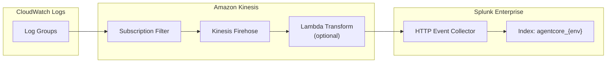

# Observability

## Overview

This document defines the observability architecture for AgentCore, including structured logging, metrics, alarms, dashboards, and Splunk integration. The design prioritizes auditability and compliance with banking regulatory requirements.

---

## Observability Architecture Diagram



---

## Log JSON Schema (Audit-Friendly)

### Base Log Structure

```json
{
  "$schema": "http://json-schema.org/draft-07/schema#",
  "title": "AgentCore Log Entry",
  "type": "object",
  "required": [
    "timestamp",
    "level",
    "message",
    "traceId",
    "agentId",
    "environment"
  ],
  "properties": {
    "timestamp": {
      "type": "string",
      "format": "date-time",
      "description": "ISO 8601 timestamp with millisecond precision"
    },
    "level": {
      "type": "string",
      "enum": ["DEBUG", "INFO", "WARN", "ERROR", "FATAL"],
      "description": "Log severity level"
    },
    "message": {
      "type": "string",
      "description": "Human-readable log message"
    },
    "traceId": {
      "type": "string",
      "pattern": "^[a-f0-9]{32}$",
      "description": "X-Ray trace ID for correlation"
    },
    "spanId": {
      "type": "string",
      "pattern": "^[a-f0-9]{16}$",
      "description": "X-Ray span ID"
    },
    "agentId": {
      "type": "string",
      "description": "AgentCore agent identifier"
    },
    "agentName": {
      "type": "string",
      "description": "Human-readable agent name"
    },
    "environment": {
      "type": "string",
      "enum": ["dev", "preprod", "prod"],
      "description": "Deployment environment"
    },
    "version": {
      "type": "string",
      "description": "Agent version (digest reference)"
    },
    "requestId": {
      "type": "string",
      "description": "Unique request identifier"
    },
    "sessionId": {
      "type": "string",
      "description": "User session identifier (if applicable)"
    },
    "userId": {
      "type": "string",
      "description": "Anonymized user identifier"
    },
    "callerAccount": {
      "type": "string",
      "pattern": "^[0-9]{12}$",
      "description": "AWS account ID of caller"
    },
    "callerRole": {
      "type": "string",
      "description": "IAM role ARN of caller"
    },
    "sourceIp": {
      "type": "string",
      "description": "Source IP address (may be VPC endpoint)"
    },
    "eventType": {
      "type": "string",
      "enum": [
        "INVOCATION_START",
        "INVOCATION_END",
        "TOOL_EXECUTION_START",
        "TOOL_EXECUTION_END",
        "MODEL_INVOCATION",
        "ERROR",
        "SECURITY_EVENT"
      ],
      "description": "Type of event being logged"
    },
    "duration": {
      "type": "object",
      "properties": {
        "total_ms": { "type": "number" },
        "model_ms": { "type": "number" },
        "tool_ms": { "type": "number" }
      },
      "description": "Duration breakdown in milliseconds"
    },
    "tokens": {
      "type": "object",
      "properties": {
        "input": { "type": "integer" },
        "output": { "type": "integer" },
        "total": { "type": "integer" }
      },
      "description": "Token usage"
    },
    "error": {
      "type": "object",
      "properties": {
        "code": { "type": "string" },
        "message": { "type": "string" },
        "type": { "type": "string" },
        "stack": { "type": "string" }
      },
      "description": "Error details if applicable"
    },
    "tool": {
      "type": "object",
      "properties": {
        "name": { "type": "string" },
        "input_hash": { "type": "string" },
        "output_hash": { "type": "string" },
        "success": { "type": "boolean" },
        "duration_ms": { "type": "number" }
      },
      "description": "Tool execution details"
    },
    "audit": {
      "type": "object",
      "properties": {
        "action": { "type": "string" },
        "resource": { "type": "string" },
        "decision": { "type": "string", "enum": ["ALLOW", "DENY"] },
        "reason": { "type": "string" }
      },
      "description": "Security/audit decision details"
    },
    "metadata": {
      "type": "object",
      "additionalProperties": true,
      "description": "Additional contextual metadata"
    }
  }
}
```

### Example Log Entries

#### Invocation Start

```json
{
  "timestamp": "2025-01-15T10:30:45.123Z",
  "level": "INFO",
  "message": "Agent invocation started",
  "traceId": "1-67890abc-def1234567890abc12345678",
  "spanId": "abcd1234efgh5678",
  "agentId": "agt-abc123",
  "agentName": "customer-support-agent",
  "environment": "prod",
  "version": "sha256:abc123def456...",
  "requestId": "req-xyz789",
  "sessionId": "sess-user123",
  "callerAccount": "444444444444",
  "callerRole": "arn:aws:iam::444444444444:role/app-service-role",
  "sourceIp": "10.0.1.50",
  "eventType": "INVOCATION_START",
  "metadata": {
    "input_token_count": 150,
    "model_id": "anthropic.claude-3-sonnet-20240229-v1:0"
  }
}
```

#### Tool Execution

```json
{
  "timestamp": "2025-01-15T10:30:46.456Z",
  "level": "INFO",
  "message": "Tool execution completed",
  "traceId": "1-67890abc-def1234567890abc12345678",
  "spanId": "ijkl9012mnop3456",
  "agentId": "agt-abc123",
  "agentName": "customer-support-agent",
  "environment": "prod",
  "requestId": "req-xyz789",
  "eventType": "TOOL_EXECUTION_END",
  "tool": {
    "name": "get_customer_info",
    "input_hash": "sha256:1234...",
    "output_hash": "sha256:5678...",
    "success": true,
    "duration_ms": 234
  }
}
```

#### Error Event

```json
{
  "timestamp": "2025-01-15T10:30:47.789Z",
  "level": "ERROR",
  "message": "Tool execution failed",
  "traceId": "1-67890abc-def1234567890abc12345678",
  "spanId": "qrst4567uvwx8901",
  "agentId": "agt-abc123",
  "agentName": "customer-support-agent",
  "environment": "prod",
  "requestId": "req-xyz789",
  "eventType": "ERROR",
  "error": {
    "code": "TOOL_EXECUTION_TIMEOUT",
    "message": "Tool execution exceeded 30 second timeout",
    "type": "TimeoutException"
  },
  "tool": {
    "name": "get_account_balance",
    "success": false,
    "duration_ms": 30000
  }
}
```

---

## CloudWatch Configuration

### Log Groups

```hcl
# modules/observability/cloudwatch.tf

resource "aws_cloudwatch_log_group" "agent" {
  for_each = var.agents
  
  name              = "${var.log_group_prefix}/${each.key}"
  retention_in_days = var.log_retention_days
  kms_key_id        = aws_kms_key.logs.arn
  
  tags = merge(var.tags, {
    AgentName = each.value.name
    AgentKey  = each.key
  })
}

# KMS key for log encryption
resource "aws_kms_key" "logs" {
  description             = "${var.name_prefix}-logs-encryption"
  deletion_window_in_days = 30
  enable_key_rotation     = true
  
  policy = jsonencode({
    Version = "2012-10-17"
    Statement = [
      {
        Sid    = "Enable IAM User Permissions"
        Effect = "Allow"
        Principal = {
          AWS = "arn:aws:iam::${data.aws_caller_identity.current.account_id}:root"
        }
        Action   = "kms:*"
        Resource = "*"
      },
      {
        Sid    = "Allow CloudWatch Logs"
        Effect = "Allow"
        Principal = {
          Service = "logs.${var.aws_region}.amazonaws.com"
        }
        Action = [
          "kms:Encrypt",
          "kms:Decrypt",
          "kms:ReEncrypt*",
          "kms:GenerateDataKey*",
          "kms:DescribeKey"
        ]
        Resource = "*"
        Condition = {
          ArnLike = {
            "kms:EncryptionContext:aws:logs:arn" = "arn:aws:logs:${var.aws_region}:${data.aws_caller_identity.current.account_id}:log-group:${var.log_group_prefix}/*"
          }
        }
      }
    ]
  })
  
  tags = var.tags
}
```

### Metric Filters

```hcl
# modules/observability/metrics.tf

# Error rate metric filter
resource "aws_cloudwatch_log_metric_filter" "errors" {
  for_each = var.agents
  
  name           = "${var.name_prefix}-${each.key}-errors"
  log_group_name = aws_cloudwatch_log_group.agent[each.key].name
  pattern        = "{ $.level = \"ERROR\" }"
  
  metric_transformation {
    name          = "ErrorCount"
    namespace     = "AgentCore/${var.environment}"
    value         = "1"
    default_value = "0"
    dimensions = {
      AgentName = each.value.name
    }
  }
}

# Invocation duration metric filter
resource "aws_cloudwatch_log_metric_filter" "duration" {
  for_each = var.agents
  
  name           = "${var.name_prefix}-${each.key}-duration"
  log_group_name = aws_cloudwatch_log_group.agent[each.key].name
  pattern        = "{ $.eventType = \"INVOCATION_END\" }"
  
  metric_transformation {
    name          = "InvocationDuration"
    namespace     = "AgentCore/${var.environment}"
    value         = "$.duration.total_ms"
    default_value = "0"
    dimensions = {
      AgentName = each.value.name
    }
  }
}

# Token usage metric filter
resource "aws_cloudwatch_log_metric_filter" "tokens" {
  for_each = var.agents
  
  name           = "${var.name_prefix}-${each.key}-tokens"
  log_group_name = aws_cloudwatch_log_group.agent[each.key].name
  pattern        = "{ $.eventType = \"INVOCATION_END\" && $.tokens.total > 0 }"
  
  metric_transformation {
    name          = "TokensUsed"
    namespace     = "AgentCore/${var.environment}"
    value         = "$.tokens.total"
    default_value = "0"
    dimensions = {
      AgentName = each.value.name
    }
  }
}
```

---

## Alarms and SLOs

### Alarm Definitions

```hcl
# modules/observability/alarms.tf

locals {
  alarm_definitions = {
    high_error_rate = {
      description = "Error rate exceeds 5% over ${var.alarm_evaluation_periods} periods"
      metric_name = "ErrorCount"
      threshold   = 5  # percentage
      comparison  = "GreaterThanThreshold"
      statistic   = "Average"
      period      = 300
      treat_missing_data = "notBreaching"
    }
    
    high_latency_p99 = {
      description = "P99 latency exceeds 10 seconds"
      metric_name = "InvocationDuration"
      threshold   = 10000  # milliseconds
      comparison  = "GreaterThanThreshold"
      statistic   = "p99"
      period      = 300
      treat_missing_data = "notBreaching"
    }
    
    high_latency_p50 = {
      description = "P50 latency exceeds 3 seconds"
      metric_name = "InvocationDuration"
      threshold   = 3000  # milliseconds
      comparison  = "GreaterThanThreshold"
      statistic   = "p50"
      period      = 300
      treat_missing_data = "notBreaching"
    }
    
    throttling = {
      description = "Throttling events detected"
      metric_name = "ThrottledInvocations"
      threshold   = 1
      comparison  = "GreaterThanOrEqualToThreshold"
      statistic   = "Sum"
      period      = 60
      treat_missing_data = "notBreaching"
    }
    
    failed_invocations = {
      description = "Failed invocations exceed threshold"
      metric_name = "FailedInvocations"
      threshold   = 10
      comparison  = "GreaterThanThreshold"
      statistic   = "Sum"
      period      = 300
      treat_missing_data = "notBreaching"
    }
  }
}

resource "aws_cloudwatch_metric_alarm" "agent_alarm" {
  for_each = {
    for pair in flatten([
      for agent_key, agent in var.agents : [
        for alarm_key, alarm in local.alarm_definitions : {
          key       = "${agent_key}-${alarm_key}"
          agent_key = agent_key
          agent     = agent
          alarm_key = alarm_key
          alarm     = alarm
        }
      ]
    ]) : pair.key => pair
  }
  
  alarm_name        = "${var.name_prefix}-${each.value.agent_key}-${each.value.alarm_key}"
  alarm_description = each.value.alarm.description
  
  namespace   = "AgentCore/${var.environment}"
  metric_name = each.value.alarm.metric_name
  
  dimensions = {
    AgentName = each.value.agent.name
  }
  
  comparison_operator = each.value.alarm.comparison
  threshold           = each.value.alarm.threshold
  evaluation_periods  = var.alarm_evaluation_periods
  period              = each.value.alarm.period
  statistic           = each.value.alarm.statistic
  
  treat_missing_data = each.value.alarm.treat_missing_data
  
  alarm_actions = [var.alarm_sns_topic_arn]
  ok_actions    = [var.alarm_sns_topic_arn]
  
  tags = merge(var.tags, {
    AgentName = each.value.agent.name
    AlarmType = each.value.alarm_key
  })
}
```

### SLO Definitions

| SLO | Target | Measurement | Alerting Threshold |
|-----|--------|-------------|-------------------|
| **Availability** | 99.9% | Successful invocations / Total invocations | < 99.5% |
| **Latency P50** | < 2s | 50th percentile response time | > 3s |
| **Latency P99** | < 10s | 99th percentile response time | > 15s |
| **Error Rate** | < 1% | Error responses / Total responses | > 5% |
| **Tool Success** | > 95% | Successful tool executions / Total tool executions | < 90% |

---

## Dashboard

```hcl
# modules/observability/dashboard.tf

resource "aws_cloudwatch_dashboard" "agentcore" {
  count = var.dashboard_enabled ? 1 : 0
  
  dashboard_name = "${var.name_prefix}-dashboard"
  
  dashboard_body = jsonencode({
    widgets = concat(
      # Overview section
      [
        {
          type   = "text"
          x      = 0
          y      = 0
          width  = 24
          height = 1
          properties = {
            markdown = "# AgentCore Dashboard - ${var.environment}\n**Environment**: ${var.environment} | **Region**: ${var.aws_region}"
          }
        }
      ],
      
      # Per-agent metrics
      flatten([
        for idx, agent_key in keys(var.agents) : [
          # Invocation count
          {
            type   = "metric"
            x      = 0
            y      = 2 + (idx * 6)
            width  = 8
            height = 6
            properties = {
              title  = "${var.agents[agent_key].name} - Invocations"
              region = var.aws_region
              metrics = [
                ["AgentCore/${var.environment}", "InvocationCount", "AgentName", var.agents[agent_key].name]
              ]
              period = 300
              stat   = "Sum"
            }
          },
          # Latency
          {
            type   = "metric"
            x      = 8
            y      = 2 + (idx * 6)
            width  = 8
            height = 6
            properties = {
              title  = "${var.agents[agent_key].name} - Latency"
              region = var.aws_region
              metrics = [
                ["AgentCore/${var.environment}", "InvocationDuration", "AgentName", var.agents[agent_key].name, { stat = "p50", label = "P50" }],
                ["...", { stat = "p99", label = "P99" }]
              ]
              period = 300
            }
          },
          # Errors
          {
            type   = "metric"
            x      = 16
            y      = 2 + (idx * 6)
            width  = 8
            height = 6
            properties = {
              title  = "${var.agents[agent_key].name} - Errors"
              region = var.aws_region
              metrics = [
                ["AgentCore/${var.environment}", "ErrorCount", "AgentName", var.agents[agent_key].name, { color = "#d62728" }]
              ]
              period = 300
              stat   = "Sum"
            }
          }
        ]
      ]),
      
      # Token usage summary
      [
        {
          type   = "metric"
          x      = 0
          y      = 2 + (length(var.agents) * 6)
          width  = 24
          height = 6
          properties = {
            title  = "Token Usage (All Agents)"
            region = var.aws_region
            metrics = [
              for agent_key, agent in var.agents : [
                "AgentCore/${var.environment}", "TokensUsed", "AgentName", agent.name
              ]
            ]
            period = 3600
            stat   = "Sum"
          }
        }
      ]
    )
  })
}
```

---

## Splunk Forwarding

### Architecture



### Implementation

```hcl
# modules/observability/splunk_forwarder.tf

# Kinesis Firehose delivery stream
resource "aws_kinesis_firehose_delivery_stream" "splunk" {
  name        = "${var.name_prefix}-splunk-forwarder"
  destination = "splunk"
  
  splunk_configuration {
    hec_endpoint               = var.splunk_hec_endpoint
    hec_token                  = data.aws_secretsmanager_secret_version.splunk_token.secret_string
    hec_acknowledgment_timeout = 300
    retry_duration             = 3600
    s3_backup_mode             = "FailedEventsOnly"
    
    s3_configuration {
      role_arn           = aws_iam_role.firehose.arn
      bucket_arn         = aws_s3_bucket.firehose_backup.arn
      prefix             = "splunk-failed/"
      compression_format = "GZIP"
    }
    
    processing_configuration {
      enabled = true
      
      processors {
        type = "Lambda"
        
        parameters {
          parameter_name  = "LambdaArn"
          parameter_value = aws_lambda_function.splunk_transform.arn
        }
      }
    }
    
    cloudwatch_logging_options {
      enabled         = true
      log_group_name  = aws_cloudwatch_log_group.firehose.name
      log_stream_name = "splunk-delivery"
    }
  }
  
  tags = var.tags
}

# Subscription filters for each log group
resource "aws_cloudwatch_log_subscription_filter" "splunk" {
  for_each = var.agents
  
  name            = "${var.name_prefix}-${each.key}-splunk"
  log_group_name  = aws_cloudwatch_log_group.agent[each.key].name
  filter_pattern  = ""  # All logs
  destination_arn = aws_kinesis_firehose_delivery_stream.splunk.arn
  role_arn        = aws_iam_role.cloudwatch_to_firehose.arn
}

# Lambda for Splunk HEC format transformation
resource "aws_lambda_function" "splunk_transform" {
  function_name = "${var.name_prefix}-splunk-transform"
  role          = aws_iam_role.splunk_transform_lambda.arn
  handler       = "index.handler"
  runtime       = "python3.11"
  timeout       = 60
  memory_size   = 256
  
  filename         = data.archive_file.splunk_transform.output_path
  source_code_hash = data.archive_file.splunk_transform.output_base64sha256
  
  environment {
    variables = {
      SPLUNK_INDEX  = "agentcore_${var.environment}"
      SPLUNK_SOURCE = "aws:agentcore"
    }
  }
  
  tags = var.tags
}

# IAM role for Firehose
resource "aws_iam_role" "firehose" {
  name = "${var.name_prefix}-firehose-role"
  
  assume_role_policy = jsonencode({
    Version = "2012-10-17"
    Statement = [
      {
        Effect = "Allow"
        Principal = {
          Service = "firehose.amazonaws.com"
        }
        Action = "sts:AssumeRole"
      }
    ]
  })
  
  tags = var.tags
}

resource "aws_iam_role_policy" "firehose" {
  name = "firehose-policy"
  role = aws_iam_role.firehose.id
  
  policy = jsonencode({
    Version = "2012-10-17"
    Statement = [
      {
        Effect = "Allow"
        Action = [
          "s3:PutObject",
          "s3:GetObject",
          "s3:ListBucket"
        ]
        Resource = [
          aws_s3_bucket.firehose_backup.arn,
          "${aws_s3_bucket.firehose_backup.arn}/*"
        ]
      },
      {
        Effect = "Allow"
        Action = [
          "lambda:InvokeFunction"
        ]
        Resource = aws_lambda_function.splunk_transform.arn
      },
      {
        Effect = "Allow"
        Action = [
          "logs:PutLogEvents"
        ]
        Resource = aws_cloudwatch_log_group.firehose.arn
      }
    ]
  })
}
```

### Splunk Transform Lambda

```python
# lambda/splunk_transform/index.py

import base64
import gzip
import json
import os

def handler(event, context):
    """
    Transform CloudWatch Logs for Splunk HEC format.
    """
    output = []
    
    for record in event['records']:
        # Decode and decompress the data
        payload = base64.b64decode(record['data'])
        payload = gzip.decompress(payload)
        log_data = json.loads(payload)
        
        # Process each log event
        transformed_events = []
        for log_event in log_data.get('logEvents', []):
            try:
                # Parse the log message (should be JSON)
                message = json.loads(log_event['message'])
            except json.JSONDecodeError:
                message = {'raw_message': log_event['message']}
            
            # Create Splunk HEC event format
            splunk_event = {
                'time': log_event['timestamp'] / 1000,  # Splunk expects seconds
                'host': log_data.get('logGroup', 'unknown'),
                'source': os.environ.get('SPLUNK_SOURCE', 'aws:agentcore'),
                'sourcetype': '_json',
                'index': os.environ.get('SPLUNK_INDEX', 'agentcore'),
                'event': message
            }
            transformed_events.append(json.dumps(splunk_event))
        
        # Combine events and encode
        output_data = '\n'.join(transformed_events)
        output.append({
            'recordId': record['recordId'],
            'result': 'Ok',
            'data': base64.b64encode(output_data.encode('utf-8')).decode('utf-8')
        })
    
    return {'records': output}
```

---

## Observability Submodule Interface

### Variables

```hcl
# modules/observability/variables.tf

variable "environment" {
  type = string
}

variable "name_prefix" {
  type = string
}

variable "aws_region" {
  type = string
}

variable "agents" {
  type = map(object({
    name           = string
    effective_tags = map(string)
  }))
}

variable "log_group_prefix" {
  type = string
}

variable "log_retention_days" {
  type = number
}

variable "metrics_resolution_seconds" {
  type = number
}

variable "alarm_evaluation_periods" {
  type = number
}

variable "splunk_hec_endpoint" {
  type = string
}

variable "splunk_hec_token_secret_arn" {
  type = string
}

variable "alarm_sns_topic_arn" {
  type = string
}

variable "enable_xray_tracing" {
  type = bool
}

variable "dashboard_enabled" {
  type = bool
}

variable "runtime_arns" {
  type = map(string)
}

variable "endpoint_arns" {
  type = map(string)
}

variable "tags" {
  type = map(string)
}
```

### Outputs

```hcl
# modules/observability/outputs.tf

output "log_group_arns" {
  value = { for k, v in aws_cloudwatch_log_group.agent : k => v.arn }
}

output "log_group_names" {
  value = { for k, v in aws_cloudwatch_log_group.agent : k => v.name }
}

output "dashboard_url" {
  value = var.dashboard_enabled ? (
    "https://${var.aws_region}.console.aws.amazon.com/cloudwatch/home?region=${var.aws_region}#dashboards:name=${aws_cloudwatch_dashboard.agentcore[0].dashboard_name}"
  ) : null
}

output "alarm_arns" {
  value = { for k, v in aws_cloudwatch_metric_alarm.agent_alarm : k => v.arn }
}

output "firehose_arn" {
  value = aws_kinesis_firehose_delivery_stream.splunk.arn
}
```

---

## Why This Design

### Why Structured JSON Logs
- **Chosen**: All logs in structured JSON with defined schema
- **Why**: Machine parseable; enables metric extraction; auditor-friendly; consistent across agents; enables Splunk field extraction
- **Why not unstructured logs**: Harder to parse; inconsistent fields; limited alerting capability; poor audit experience

### Why CloudWatch + Splunk
- **Chosen**: CloudWatch as primary with Splunk forwarding
- **Why**: CloudWatch provides native integration; Splunk provides enterprise search and compliance; dual-write provides redundancy
- **Why not Splunk only**: Loses native CloudWatch integrations; higher latency for real-time alerting; more complex architecture

### Why Kinesis Firehose for Forwarding
- **Chosen**: CloudWatch → Firehose → Splunk HEC
- **Why**: Managed delivery; automatic retry; backup on failure; handles scale; Lambda transformation capability
- **Why not direct Lambda subscription**: Less reliable; no native batching; harder to manage at scale

### Why KMS Encryption for Logs
- **Chosen**: Customer-managed KMS key for log encryption
- **Why**: Banking data protection requirements; key rotation; audit trail on key usage; compliance requirement
- **Why not default encryption**: Less control; no key usage audit; may not meet compliance requirements


